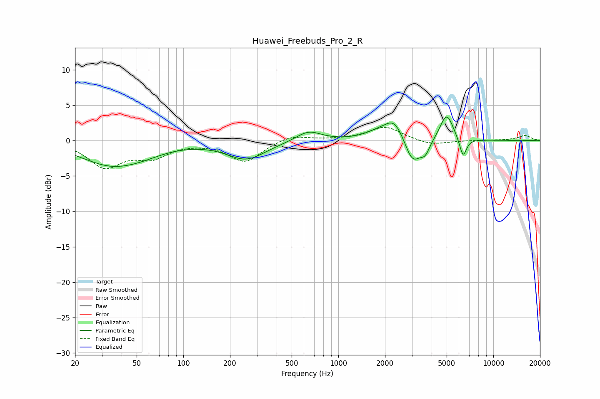

# Huawei_Freebuds_Pro_2_R
See [usage instructions](https://github.com/jaakkopasanen/AutoEq#usage) for more options and info.

### Parametric EQs
Apply preamp of -3.4 dB when using parametric equalizer.

|   # | Type    |   Fc (Hz) |    Q |   Gain (dB) |
|-----|---------|-----------|------|-------------|
|   1 | Peaking |        34 | 0.7  |        -3.3 |
|   2 | Peaking |        55 | 1.05 |        -0.6 |
|   3 | Peaking |       255 | 1.14 |        -2.6 |
|   4 | Peaking |       642 | 1.76 |         1.5 |
|   5 | Peaking |      1811 | 1.6  |         0.9 |
|   6 | Peaking |      2307 | 2.25 |         2.8 |
|   7 | Peaking |      3010 | 2.7  |        -3.7 |
|   8 | Peaking |      3634 | 4.64 |        -1.6 |
|   9 | Peaking |      4997 | 3.25 |         3.9 |
|  10 | Peaking |      6375 | 6    |        -2.8 |

### Fixed Band EQs
When using fixed band (also called graphic) equalizer, apply preamp of **-2.0 dB** (if available) and set gains manually with these parameters.

|   # | Type    |   Fc (Hz) |    Q |   Gain (dB) |
|-----|---------|-----------|------|-------------|
|   1 | Peaking |        31 | 1.41 |        -3.6 |
|   2 | Peaking |        62 | 1.41 |        -2.1 |
|   3 | Peaking |       125 | 1.41 |        -0.1 |
|   4 | Peaking |       250 | 1.41 |        -3   |
|   5 | Peaking |       500 | 1.41 |         0.9 |
|   6 | Peaking |      1000 | 1.41 |         0.1 |
|   7 | Peaking |      2000 | 1.41 |         2   |
|   8 | Peaking |      4000 | 1.41 |        -0.7 |
|   9 | Peaking |      8000 | 1.41 |         0   |
|  10 | Peaking |     16000 | 1.41 |         0.7 |

### Graphs

