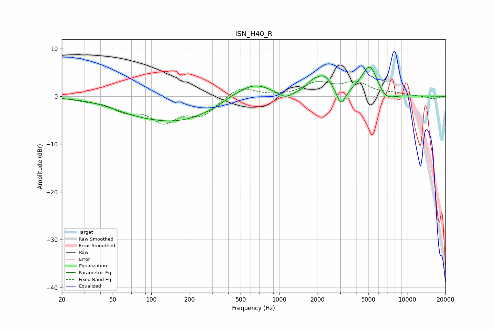

# ISN_H40_R
See [usage instructions](https://github.com/jaakkopasanen/AutoEq#usage) for more options and info.

### Parametric EQs
Apply preamp of -6.2 dB when using parametric equalizer.

|   # | Type    |   Fc (Hz) |    Q |   Gain (dB) |
|-----|---------|-----------|------|-------------|
|   1 | Peaking |        70 | 0.87 |        -1   |
|   2 | Peaking |       158 | 0.46 |        -5   |
|   3 | Peaking |       424 | 2.25 |         0.5 |
|   4 | Peaking |       630 | 1.07 |         3.3 |
|   5 | Peaking |      1114 | 2.63 |        -1.3 |
|   6 | Peaking |      1807 | 3.42 |         1   |
|   7 | Peaking |      2240 | 1.89 |         4   |
|   8 | Peaking |      3043 | 3.8  |        -3.9 |
|   9 | Peaking |      5153 | 2.02 |         7.1 |
|  10 | Peaking |      6645 | 1.87 |        -2.5 |

### Fixed Band EQs
When using fixed band (also called graphic) equalizer, apply preamp of **-3.3 dB** (if available) and set gains manually with these parameters.

|   # | Type    |   Fc (Hz) |    Q |   Gain (dB) |
|-----|---------|-----------|------|-------------|
|   1 | Peaking |        31 | 1.41 |        -0.6 |
|   2 | Peaking |        62 | 1.41 |        -2.5 |
|   3 | Peaking |       125 | 1.41 |        -4.8 |
|   4 | Peaking |       250 | 1.41 |        -3.6 |
|   5 | Peaking |       500 | 1.41 |         2.2 |
|   6 | Peaking |      1000 | 1.41 |        -0.1 |
|   7 | Peaking |      2000 | 1.41 |         2.6 |
|   8 | Peaking |      4000 | 1.41 |         2.6 |
|   9 | Peaking |      8000 | 1.41 |         0.5 |
|  10 | Peaking |     16000 | 1.41 |        -0.6 |

### Graphs

