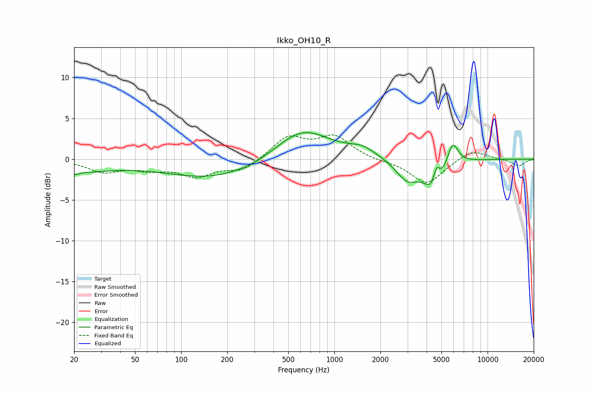

# Ikko_OH10_R
See [usage instructions](https://github.com/jaakkopasanen/AutoEq#usage) for more options and info.

### Parametric EQs
Apply preamp of -3.3 dB when using parametric equalizer.

|   # | Type    |   Fc (Hz) |    Q |   Gain (dB) |
|-----|---------|-----------|------|-------------|
|   1 | Peaking |        20 | 5.19 |        -0.4 |
|   2 | Peaking |        21 | 0.62 |        -1.4 |
|   3 | Peaking |       188 | 0.4  |        -2.6 |
|   4 | Peaking |       216 | 1.22 |         0.1 |
|   5 | Peaking |       608 | 0.75 |         4.2 |
|   6 | Peaking |      1526 | 1.62 |         1   |
|   7 | Peaking |      2986 | 1.9  |        -2.5 |
|   8 | Peaking |      4501 | 2.31 |        -4.1 |
|   9 | Peaking |      4645 | 6    |         2.8 |
|  10 | Peaking |      5916 | 3.82 |         3   |

### Fixed Band EQs
When using fixed band (also called graphic) equalizer, apply preamp of **-3.1 dB** (if available) and set gains manually with these parameters.

|   # | Type    |   Fc (Hz) |    Q |   Gain (dB) |
|-----|---------|-----------|------|-------------|
|   1 | Peaking |        31 | 1.41 |        -1.5 |
|   2 | Peaking |        62 | 1.41 |        -1   |
|   3 | Peaking |       125 | 1.41 |        -1.9 |
|   4 | Peaking |       250 | 1.41 |        -1.4 |
|   5 | Peaking |       500 | 1.41 |         2.7 |
|   6 | Peaking |      1000 | 1.41 |         2.6 |
|   7 | Peaking |      2000 | 1.41 |        -0.2 |
|   8 | Peaking |      4000 | 1.41 |        -3.1 |
|   9 | Peaking |      8000 | 1.41 |         1.2 |
|  10 | Peaking |     16000 | 1.41 |        -0.9 |

### Graphs

