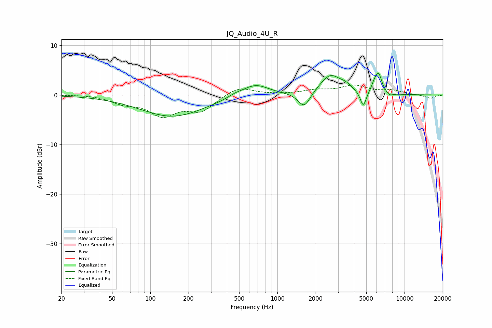

# JQ_Audio_4U_R
See [usage instructions](https://github.com/jaakkopasanen/AutoEq#usage) for more options and info.

### Parametric EQs
Apply preamp of -4.5 dB when using parametric equalizer.

|   # | Type    |   Fc (Hz) |    Q |   Gain (dB) |
|-----|---------|-----------|------|-------------|
|   1 | Peaking |       150 | 0.56 |        -4.3 |
|   2 | Peaking |       464 | 2.54 |         0.5 |
|   3 | Peaking |       669 | 1.34 |         2.4 |
|   4 | Peaking |      1624 | 2.99 |        -3.2 |
|   5 | Peaking |      2601 | 1.74 |         3.9 |
|   6 | Peaking |      3453 | 2.87 |         1   |
|   7 | Peaking |      4735 | 6    |        -3.2 |
|   8 | Peaking |      5785 | 5.97 |         1.3 |
|   9 | Peaking |      6256 | 5.15 |         3.7 |
|  10 | Peaking |      7616 | 4.93 |        -0.6 |

### Fixed Band EQs
When using fixed band (also called graphic) equalizer, apply preamp of **-2.1 dB** (if available) and set gains manually with these parameters.

|   # | Type    |   Fc (Hz) |    Q |   Gain (dB) |
|-----|---------|-----------|------|-------------|
|   1 | Peaking |        31 | 1.41 |         0.1 |
|   2 | Peaking |        62 | 1.41 |        -1.4 |
|   3 | Peaking |       125 | 1.41 |        -3.8 |
|   4 | Peaking |       250 | 1.41 |        -3   |
|   5 | Peaking |       500 | 1.41 |         1.8 |
|   6 | Peaking |      1000 | 1.41 |         0   |
|   7 | Peaking |      2000 | 1.41 |         0.8 |
|   8 | Peaking |      4000 | 1.41 |         1.8 |
|   9 | Peaking |      8000 | 1.41 |         0.8 |
|  10 | Peaking |     16000 | 1.41 |        -0.7 |

### Graphs

