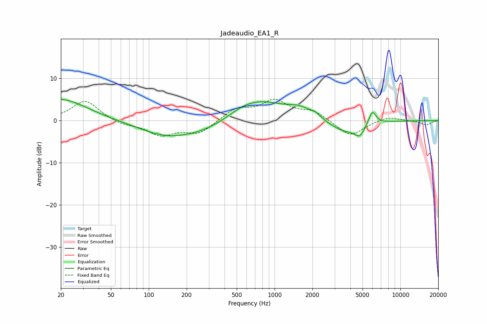

# Jadeaudio_EA1_R
See [usage instructions](https://github.com/jaakkopasanen/AutoEq#usage) for more options and info.

### Parametric EQs
Apply preamp of -5.1 dB when using parametric equalizer.

|   # | Type    |   Fc (Hz) |    Q |   Gain (dB) |
|-----|---------|-----------|------|-------------|
|   1 | Peaking |        20 | 0.68 |         5.2 |
|   2 | Peaking |       139 | 0.64 |        -3.4 |
|   3 | Peaking |       285 | 0.72 |        -1.7 |
|   4 | Peaking |       549 | 1.46 |         0.7 |
|   5 | Peaking |       764 | 0.69 |         4.6 |
|   6 | Peaking |      1610 | 1.45 |         2   |
|   7 | Peaking |      2123 | 3.96 |         0.8 |
|   8 | Peaking |      3570 | 1.14 |        -2.8 |
|   9 | Peaking |      4740 | 3.47 |        -2.5 |
|  10 | Peaking |      5986 | 4.6  |         3.3 |

### Fixed Band EQs
When using fixed band (also called graphic) equalizer, apply preamp of **-5.1 dB** (if available) and set gains manually with these parameters.

|   # | Type    |   Fc (Hz) |    Q |   Gain (dB) |
|-----|---------|-----------|------|-------------|
|   1 | Peaking |        31 | 1.41 |         4.8 |
|   2 | Peaking |        62 | 1.41 |        -1   |
|   3 | Peaking |       125 | 1.41 |        -3.3 |
|   4 | Peaking |       250 | 1.41 |        -3   |
|   5 | Peaking |       500 | 1.41 |         2.7 |
|   6 | Peaking |      1000 | 1.41 |         4.4 |
|   7 | Peaking |      2000 | 1.41 |         2.1 |
|   8 | Peaking |      4000 | 1.41 |        -3.8 |
|   9 | Peaking |      8000 | 1.41 |         1.1 |
|  10 | Peaking |     16000 | 1.41 |        -1   |

### Graphs

