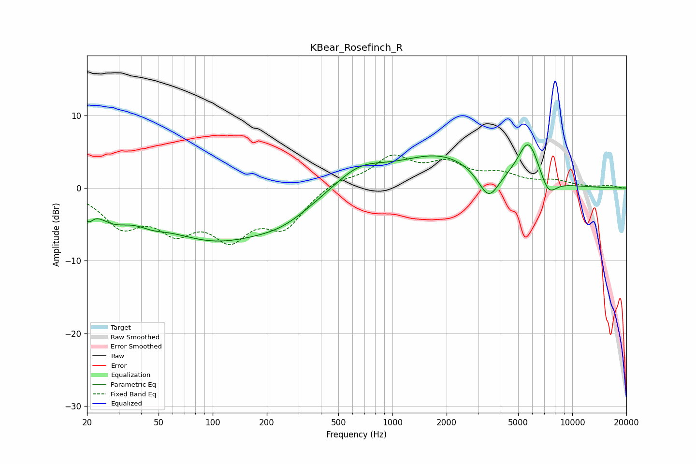

# KBear_Rosefinch_R
See [usage instructions](https://github.com/jaakkopasanen/AutoEq#usage) for more options and info.

### Parametric EQs
Apply preamp of -6.1 dB when using parametric equalizer.

|   # | Type    |   Fc (Hz) |    Q |   Gain (dB) |
|-----|---------|-----------|------|-------------|
|   1 | Peaking |        20 | 5.53 |        -2   |
|   2 | Peaking |        28 | 1.5  |        -2.5 |
|   3 | Peaking |        46 | 1.85 |        -0.9 |
|   4 | Peaking |       101 | 0.45 |        -6.6 |
|   5 | Peaking |       246 | 0.84 |        -2.2 |
|   6 | Peaking |       652 | 1.01 |         2.8 |
|   7 | Peaking |      1841 | 0.59 |         4.4 |
|   8 | Peaking |      3427 | 2.4  |        -4.1 |
|   9 | Peaking |      5705 | 2.32 |         5.9 |
|  10 | Peaking |      7360 | 3.02 |        -2.6 |

### Fixed Band EQs
When using fixed band (also called graphic) equalizer, apply preamp of **-4.7 dB** (if available) and set gains manually with these parameters.

|   # | Type    |   Fc (Hz) |    Q |   Gain (dB) |
|-----|---------|-----------|------|-------------|
|   1 | Peaking |        31 | 1.41 |        -4.7 |
|   2 | Peaking |        62 | 1.41 |        -4.8 |
|   3 | Peaking |       125 | 1.41 |        -5.9 |
|   4 | Peaking |       250 | 1.41 |        -4.9 |
|   5 | Peaking |       500 | 1.41 |         1.2 |
|   6 | Peaking |      1000 | 1.41 |         4   |
|   7 | Peaking |      2000 | 1.41 |         2.9 |
|   8 | Peaking |      4000 | 1.41 |         1.6 |
|   9 | Peaking |      8000 | 1.41 |         0.9 |
|  10 | Peaking |     16000 | 1.41 |         0.3 |

### Graphs

