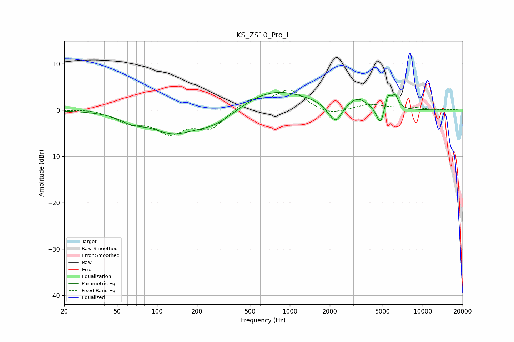

# KS_ZS10_Pro_L
See [usage instructions](https://github.com/jaakkopasanen/AutoEq#usage) for more options and info.

### Parametric EQs
Apply preamp of -3.9 dB when using parametric equalizer.

|   # | Type    |   Fc (Hz) |    Q |   Gain (dB) |
|-----|---------|-----------|------|-------------|
|   1 | Peaking |        65 | 1.57 |        -1.5 |
|   2 | Peaking |       130 | 0.87 |        -4.2 |
|   3 | Peaking |       272 | 0.86 |        -3.3 |
|   4 | Peaking |       754 | 0.55 |         4.6 |
|   5 | Peaking |      1989 | 3.47 |        -1.2 |
|   6 | Peaking |      2244 | 3.54 |        -3.4 |
|   7 | Peaking |      3267 | 2.05 |         2.2 |
|   8 | Peaking |      4813 | 4.9  |        -4.2 |
|   9 | Peaking |      5469 | 5.92 |         3.2 |
|  10 | Peaking |      6210 | 6    |         2.7 |

### Fixed Band EQs
When using fixed band (also called graphic) equalizer, apply preamp of **-4.4 dB** (if available) and set gains manually with these parameters.

|   # | Type    |   Fc (Hz) |    Q |   Gain (dB) |
|-----|---------|-----------|------|-------------|
|   1 | Peaking |        31 | 1.41 |         0.4 |
|   2 | Peaking |        62 | 1.41 |        -2.4 |
|   3 | Peaking |       125 | 1.41 |        -4.4 |
|   4 | Peaking |       250 | 1.41 |        -3.8 |
|   5 | Peaking |       500 | 1.41 |         2.3 |
|   6 | Peaking |      1000 | 1.41 |         4.3 |
|   7 | Peaking |      2000 | 1.41 |        -1.3 |
|   8 | Peaking |      4000 | 1.41 |         1.2 |
|   9 | Peaking |      8000 | 1.41 |         0.5 |
|  10 | Peaking |     16000 | 1.41 |         0.1 |

### Graphs

