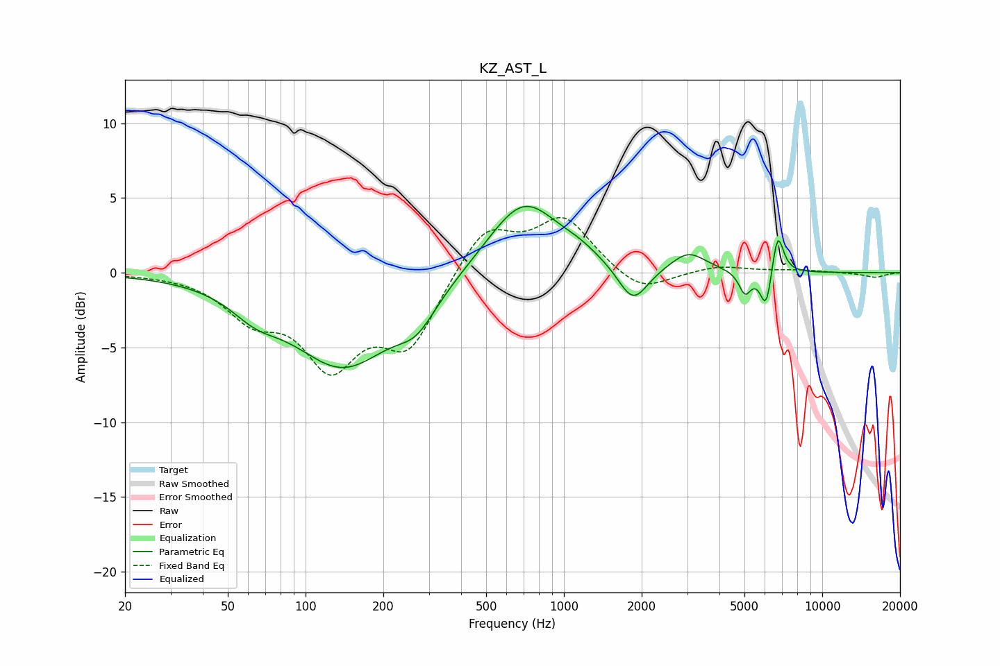

# KZ_AST_L
See [usage instructions](https://github.com/jaakkopasanen/AutoEq#usage) for more options and info.

### Parametric EQs
Apply preamp of -4.5 dB when using parametric equalizer.

|   # | Type    |   Fc (Hz) |    Q |   Gain (dB) |
|-----|---------|-----------|------|-------------|
|   1 | Peaking |        64 | 1.52 |        -1.3 |
|   2 | Peaking |       140 | 0.71 |        -6.1 |
|   3 | Peaking |       269 | 1.82 |        -1.9 |
|   4 | Peaking |       698 | 1.02 |         5   |
|   5 | Peaking |      1157 | 1.98 |         0.5 |
|   6 | Peaking |      1851 | 2.46 |        -2.5 |
|   7 | Peaking |      3035 | 2.08 |         1.3 |
|   8 | Peaking |      5025 | 6    |        -1.5 |
|   9 | Peaking |      6072 | 6    |        -2.8 |
|  10 | Peaking |      6714 | 5.99 |         3   |

### Fixed Band EQs
When using fixed band (also called graphic) equalizer, apply preamp of **-3.8 dB** (if available) and set gains manually with these parameters.

|   # | Type    |   Fc (Hz) |    Q |   Gain (dB) |
|-----|---------|-----------|------|-------------|
|   1 | Peaking |        31 | 1.41 |        -0   |
|   2 | Peaking |        62 | 1.41 |        -2.6 |
|   3 | Peaking |       125 | 1.41 |        -5.6 |
|   4 | Peaking |       250 | 1.41 |        -4.7 |
|   5 | Peaking |       500 | 1.41 |         3.2 |
|   6 | Peaking |      1000 | 1.41 |         3.5 |
|   7 | Peaking |      2000 | 1.41 |        -1.5 |
|   8 | Peaking |      4000 | 1.41 |         0.5 |
|   9 | Peaking |      8000 | 1.41 |         0.2 |
|  10 | Peaking |     16000 | 1.41 |        -0.3 |

### Graphs

