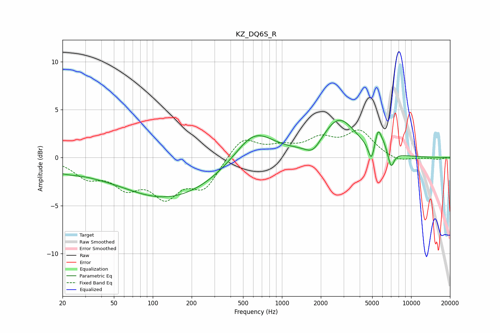

# KZ_DQ6S_R
See [usage instructions](https://github.com/jaakkopasanen/AutoEq#usage) for more options and info.

### Parametric EQs
Apply preamp of -4.0 dB when using parametric equalizer.

|   # | Type    |   Fc (Hz) |    Q |   Gain (dB) |
|-----|---------|-----------|------|-------------|
|   1 | Peaking |        20 | 0.95 |        -1   |
|   2 | Peaking |        38 | 1.29 |        -0.2 |
|   3 | Peaking |       131 | 0.36 |        -4.2 |
|   4 | Peaking |       609 | 0.95 |         3.3 |
|   5 | Peaking |      1739 | 2.31 |        -1.3 |
|   6 | Peaking |      2771 | 1.1  |         4   |
|   7 | Peaking |      4925 | 6    |        -1.9 |
|   8 | Peaking |      5549 | 5.96 |         1.9 |
|   9 | Peaking |      6094 | 4.36 |         0.8 |
|  10 | Peaking |      6999 | 5.88 |        -1.7 |

### Fixed Band EQs
When using fixed band (also called graphic) equalizer, apply preamp of **-3.0 dB** (if available) and set gains manually with these parameters.

|   # | Type    |   Fc (Hz) |    Q |   Gain (dB) |
|-----|---------|-----------|------|-------------|
|   1 | Peaking |        31 | 1.41 |        -1.8 |
|   2 | Peaking |        62 | 1.41 |        -2.6 |
|   3 | Peaking |       125 | 1.41 |        -3.6 |
|   4 | Peaking |       250 | 1.41 |        -3   |
|   5 | Peaking |       500 | 1.41 |         2.2 |
|   6 | Peaking |      1000 | 1.41 |         0.9 |
|   7 | Peaking |      2000 | 1.41 |         1.7 |
|   8 | Peaking |      4000 | 1.41 |         2.6 |
|   9 | Peaking |      8000 | 1.41 |        -0.5 |
|  10 | Peaking |     16000 | 1.41 |        -0.2 |

### Graphs

