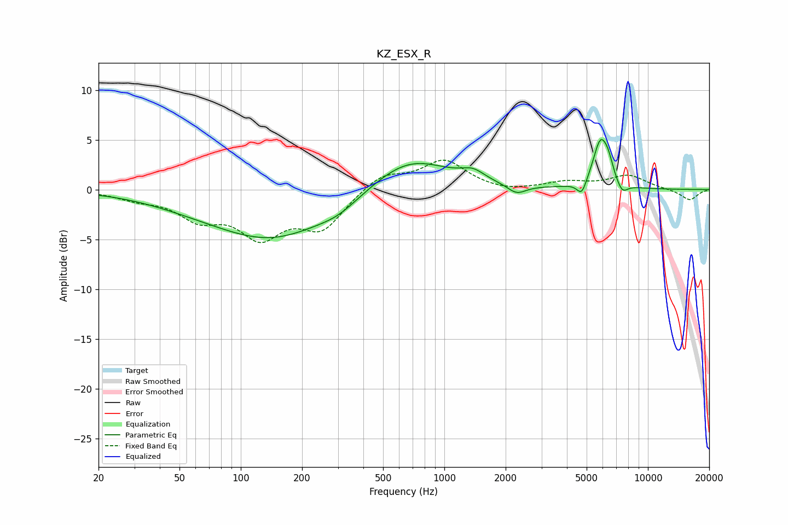

# KZ_ESX_R
See [usage instructions](https://github.com/jaakkopasanen/AutoEq#usage) for more options and info.

### Parametric EQs
Apply preamp of -5.1 dB when using parametric equalizer.

|   # | Type    |   Fc (Hz) |    Q |   Gain (dB) |
|-----|---------|-----------|------|-------------|
|   1 | Peaking |        54 | 0.61 |        -0.6 |
|   2 | Peaking |       143 | 0.49 |        -4.8 |
|   3 | Peaking |       302 | 1.43 |        -0.8 |
|   4 | Peaking |       673 | 0.74 |         3.4 |
|   5 | Peaking |      1382 | 2.46 |         1   |
|   6 | Peaking |      2266 | 3.11 |        -0.9 |
|   7 | Peaking |      4732 | 6    |        -1.5 |
|   8 | Peaking |      5854 | 3.67 |         4.7 |
|   9 | Peaking |      6401 | 6    |         1.2 |
|  10 | Peaking |      7476 | 5.09 |        -1.1 |

### Fixed Band EQs
When using fixed band (also called graphic) equalizer, apply preamp of **-3.0 dB** (if available) and set gains manually with these parameters.

|   # | Type    |   Fc (Hz) |    Q |   Gain (dB) |
|-----|---------|-----------|------|-------------|
|   1 | Peaking |        31 | 1.41 |        -0.7 |
|   2 | Peaking |        62 | 1.41 |        -2.5 |
|   3 | Peaking |       125 | 1.41 |        -4.2 |
|   4 | Peaking |       250 | 1.41 |        -3.7 |
|   5 | Peaking |       500 | 1.41 |         1.6 |
|   6 | Peaking |      1000 | 1.41 |         2.8 |
|   7 | Peaking |      2000 | 1.41 |        -0.3 |
|   8 | Peaking |      4000 | 1.41 |         0.7 |
|   9 | Peaking |      8000 | 1.41 |         1.4 |
|  10 | Peaking |     16000 | 1.41 |        -1.1 |

### Graphs

