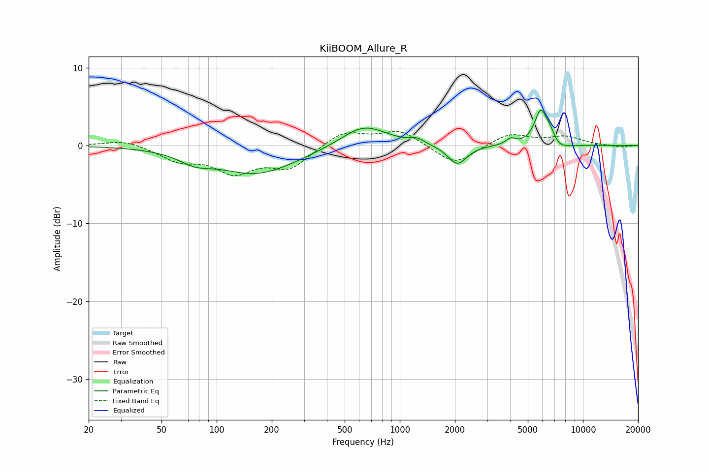

# KiiBOOM_Allure_R
See [usage instructions](https://github.com/jaakkopasanen/AutoEq#usage) for more options and info.

### Parametric EQs
Apply preamp of -4.7 dB when using parametric equalizer.

|   # | Type    |   Fc (Hz) |    Q |   Gain (dB) |
|-----|---------|-----------|------|-------------|
|   1 | Peaking |        76 | 1.64 |        -1.2 |
|   2 | Peaking |       166 | 0.64 |        -3.6 |
|   3 | Peaking |       638 | 1.14 |         2.8 |
|   4 | Peaking |      1243 | 3.83 |         0.6 |
|   5 | Peaking |      2060 | 2.72 |        -2.5 |
|   6 | Peaking |      4037 | 5.59 |         0.7 |
|   7 | Peaking |      5884 | 4.06 |         4.4 |
|   8 | Peaking |      6603 | 6    |         0.9 |
|   9 | Peaking |      7502 | 4.59 |        -0.5 |
|  10 | Peaking |      8464 | 2.73 |        -0.2 |

### Fixed Band EQs
When using fixed band (also called graphic) equalizer, apply preamp of **-1.9 dB** (if available) and set gains manually with these parameters.

|   # | Type    |   Fc (Hz) |    Q |   Gain (dB) |
|-----|---------|-----------|------|-------------|
|   1 | Peaking |        31 | 1.41 |         0.8 |
|   2 | Peaking |        62 | 1.41 |        -1.8 |
|   3 | Peaking |       125 | 1.41 |        -3.2 |
|   4 | Peaking |       250 | 1.41 |        -2.7 |
|   5 | Peaking |       500 | 1.41 |         1.9 |
|   6 | Peaking |      1000 | 1.41 |         1.9 |
|   7 | Peaking |      2000 | 1.41 |        -2.6 |
|   8 | Peaking |      4000 | 1.41 |         1.6 |
|   9 | Peaking |      8000 | 1.41 |         1.1 |
|  10 | Peaking |     16000 | 1.41 |        -0.2 |

### Graphs

