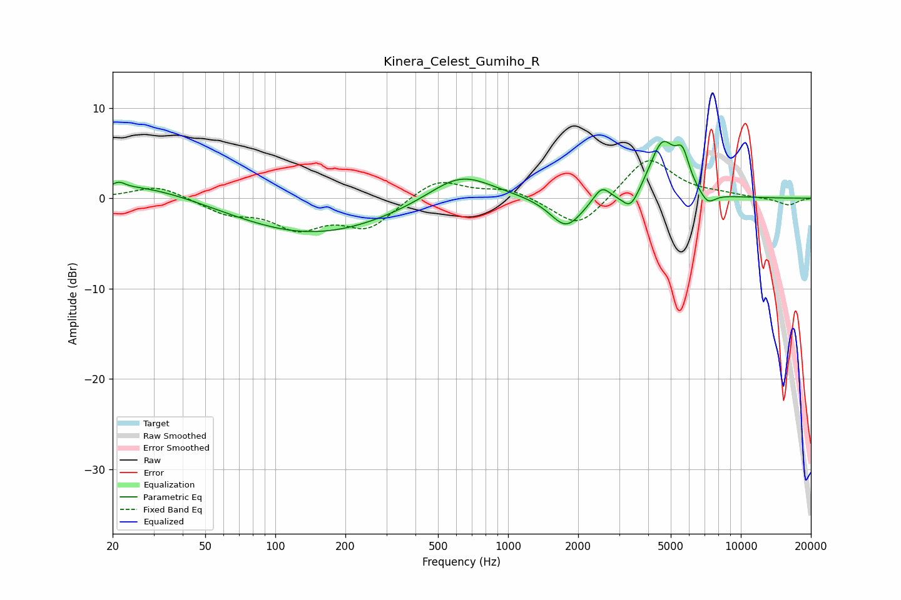

# Kinera_Celest_Gumiho_R
See [usage instructions](https://github.com/jaakkopasanen/AutoEq#usage) for more options and info.

### Parametric EQs
Apply preamp of -6.4 dB when using parametric equalizer.

|   # | Type    |   Fc (Hz) |    Q |   Gain (dB) |
|-----|---------|-----------|------|-------------|
|   1 | Peaking |        21 | 5.8  |         0.5 |
|   2 | Peaking |        26 | 0.56 |         1.8 |
|   3 | Peaking |       144 | 0.42 |        -4   |
|   4 | Peaking |       624 | 1.02 |         3.2 |
|   5 | Peaking |      1777 | 2.05 |        -3.4 |
|   6 | Peaking |      2524 | 4.08 |         1.7 |
|   7 | Peaking |      3364 | 3.77 |        -2.2 |
|   8 | Peaking |      4603 | 2.48 |         6   |
|   9 | Peaking |      5615 | 4.7  |         3.3 |
|  10 | Peaking |      7195 | 3.98 |        -1.4 |

### Fixed Band EQs
When using fixed band (also called graphic) equalizer, apply preamp of **-4.2 dB** (if available) and set gains manually with these parameters.

|   # | Type    |   Fc (Hz) |    Q |   Gain (dB) |
|-----|---------|-----------|------|-------------|
|   1 | Peaking |        31 | 1.41 |         1.5 |
|   2 | Peaking |        62 | 1.41 |        -1.5 |
|   3 | Peaking |       125 | 1.41 |        -3   |
|   4 | Peaking |       250 | 1.41 |        -3.1 |
|   5 | Peaking |       500 | 1.41 |         2.2 |
|   6 | Peaking |      1000 | 1.41 |         1.1 |
|   7 | Peaking |      2000 | 1.41 |        -3.5 |
|   8 | Peaking |      4000 | 1.41 |         4.7 |
|   9 | Peaking |      8000 | 1.41 |         0.3 |
|  10 | Peaking |     16000 | 1.41 |        -0.8 |

### Graphs

