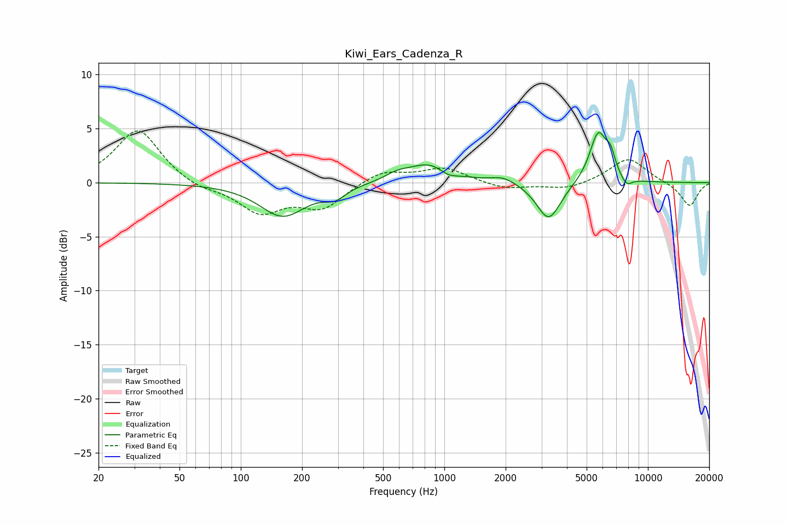

# Kiwi_Ears_Cadenza_R
See [usage instructions](https://github.com/jaakkopasanen/AutoEq#usage) for more options and info.

### Parametric EQs
Apply preamp of -4.7 dB when using parametric equalizer.

|   # | Type    |   Fc (Hz) |    Q |   Gain (dB) |
|-----|---------|-----------|------|-------------|
|   1 | Peaking |       161 | 1.25 |        -3.1 |
|   2 | Peaking |       290 | 2.59 |        -1   |
|   3 | Peaking |       587 | 2.44 |         0.6 |
|   4 | Peaking |       850 | 1.36 |         1.8 |
|   5 | Peaking |      1042 | 3.1  |        -0.6 |
|   6 | Peaking |      1947 | 2.35 |         0.6 |
|   7 | Peaking |      3255 | 2.37 |        -3.6 |
|   8 | Peaking |      5702 | 3.2  |         4.7 |
|   9 | Peaking |      6558 | 5.99 |         1.6 |
|  10 | Peaking |      7850 | 4.86 |        -0.8 |

### Fixed Band EQs
When using fixed band (also called graphic) equalizer, apply preamp of **-4.9 dB** (if available) and set gains manually with these parameters.

|   # | Type    |   Fc (Hz) |    Q |   Gain (dB) |
|-----|---------|-----------|------|-------------|
|   1 | Peaking |        31 | 1.41 |         5   |
|   2 | Peaking |        62 | 1.41 |        -0.7 |
|   3 | Peaking |       125 | 1.41 |        -2.6 |
|   4 | Peaking |       250 | 1.41 |        -2.2 |
|   5 | Peaking |       500 | 1.41 |         1.1 |
|   6 | Peaking |      1000 | 1.41 |         1.3 |
|   7 | Peaking |      2000 | 1.41 |        -0.6 |
|   8 | Peaking |      4000 | 1.41 |        -0.6 |
|   9 | Peaking |      8000 | 1.41 |         2.3 |
|  10 | Peaking |     16000 | 1.41 |        -2.2 |

### Graphs

