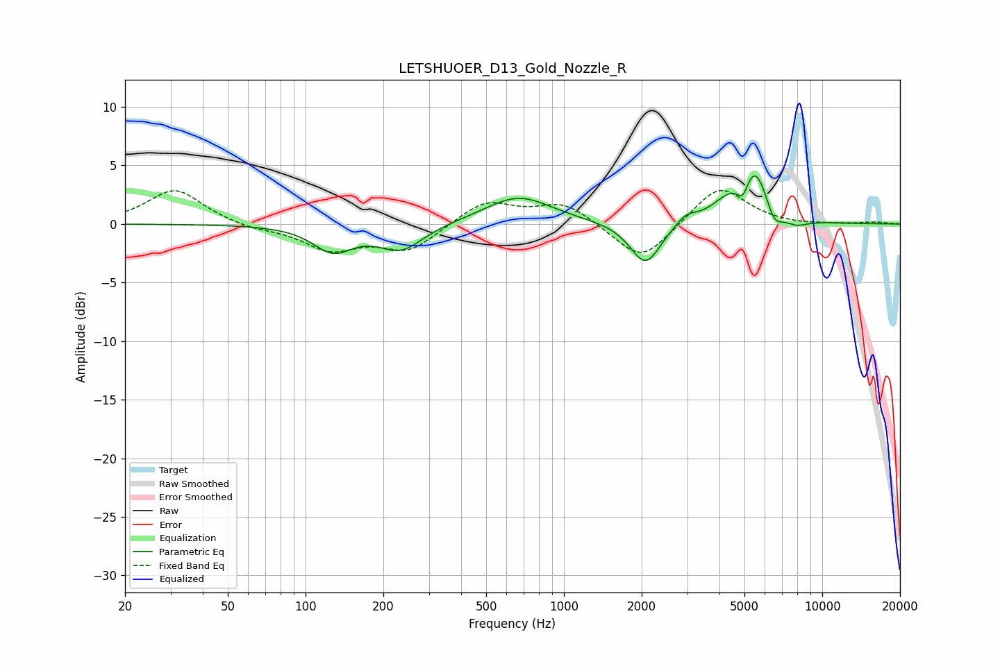

# LETSHUOER_D13_Gold_Nozzle_R
See [usage instructions](https://github.com/jaakkopasanen/AutoEq#usage) for more options and info.

### Parametric EQs
Apply preamp of -4.2 dB when using parametric equalizer.

|   # | Type    |   Fc (Hz) |    Q |   Gain (dB) |
|-----|---------|-----------|------|-------------|
|   1 | Peaking |       128 | 1.84 |        -2.2 |
|   2 | Peaking |       234 | 1.63 |        -2.2 |
|   3 | Peaking |       666 | 1.08 |         2.4 |
|   4 | Peaking |      2070 | 2.39 |        -3.7 |
|   5 | Peaking |      2969 | 3.65 |         0.8 |
|   6 | Peaking |      4356 | 1.93 |         1.5 |
|   7 | Peaking |      4931 | 6    |        -1.7 |
|   8 | Peaking |      5471 | 2.53 |         4.5 |
|   9 | Peaking |      6507 | 4.18 |        -1.7 |
|  10 | Peaking |      7893 | 2.89 |        -0.6 |

### Fixed Band EQs
When using fixed band (also called graphic) equalizer, apply preamp of **-3.0 dB** (if available) and set gains manually with these parameters.

|   # | Type    |   Fc (Hz) |    Q |   Gain (dB) |
|-----|---------|-----------|------|-------------|
|   1 | Peaking |        31 | 1.41 |         3   |
|   2 | Peaking |        62 | 1.41 |        -0.4 |
|   3 | Peaking |       125 | 1.41 |        -2.1 |
|   4 | Peaking |       250 | 1.41 |        -2.2 |
|   5 | Peaking |       500 | 1.41 |         2   |
|   6 | Peaking |      1000 | 1.41 |         1.8 |
|   7 | Peaking |      2000 | 1.41 |        -3.4 |
|   8 | Peaking |      4000 | 1.41 |         3.4 |
|   9 | Peaking |      8000 | 1.41 |        -0.1 |
|  10 | Peaking |     16000 | 1.41 |         0.1 |

### Graphs

