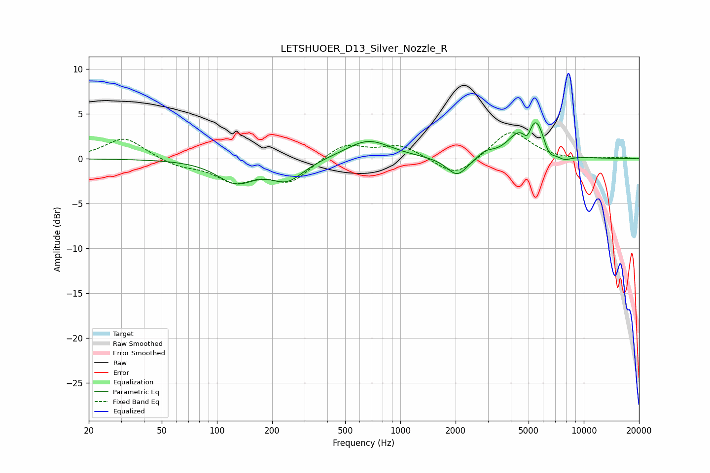

# LETSHUOER_D13_Silver_Nozzle_R
See [usage instructions](https://github.com/jaakkopasanen/AutoEq#usage) for more options and info.

### Parametric EQs
Apply preamp of -4.1 dB when using parametric equalizer.

|   # | Type    |   Fc (Hz) |    Q |   Gain (dB) |
|-----|---------|-----------|------|-------------|
|   1 | Peaking |       127 | 1.39 |        -2.5 |
|   2 | Peaking |       242 | 1.58 |        -2.3 |
|   3 | Peaking |       667 | 1.16 |         2.1 |
|   4 | Peaking |      2041 | 2.5  |        -2.1 |
|   5 | Peaking |      2915 | 3.43 |         0.6 |
|   6 | Peaking |      4363 | 2.26 |         1.7 |
|   7 | Peaking |      4925 | 6    |        -1.7 |
|   8 | Peaking |      5484 | 2.41 |         4.5 |
|   9 | Peaking |      6412 | 4.02 |        -1.7 |
|  10 | Peaking |      7772 | 2.96 |        -0.7 |

### Fixed Band EQs
When using fixed band (also called graphic) equalizer, apply preamp of **-3.0 dB** (if available) and set gains manually with these parameters.

|   # | Type    |   Fc (Hz) |    Q |   Gain (dB) |
|-----|---------|-----------|------|-------------|
|   1 | Peaking |        31 | 1.41 |         2.4 |
|   2 | Peaking |        62 | 1.41 |        -0.8 |
|   3 | Peaking |       125 | 1.41 |        -2.3 |
|   4 | Peaking |       250 | 1.41 |        -2.5 |
|   5 | Peaking |       500 | 1.41 |         1.7 |
|   6 | Peaking |      1000 | 1.41 |         1.5 |
|   7 | Peaking |      2000 | 1.41 |        -2.2 |
|   8 | Peaking |      4000 | 1.41 |         3.2 |
|   9 | Peaking |      8000 | 1.41 |        -0.1 |
|  10 | Peaking |     16000 | 1.41 |         0.2 |

### Graphs

