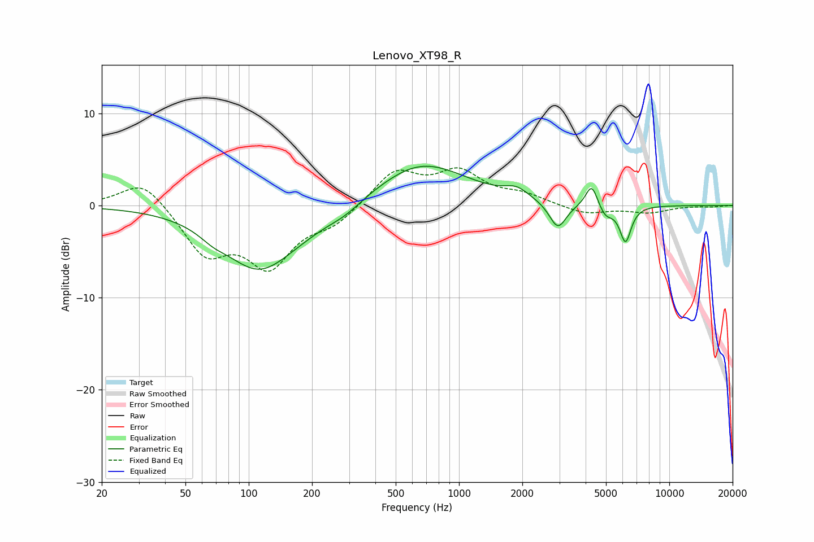

# Lenovo_XT98_R
See [usage instructions](https://github.com/jaakkopasanen/AutoEq#usage) for more options and info.

### Parametric EQs
Apply preamp of -4.4 dB when using parametric equalizer.

|   # | Type    |   Fc (Hz) |    Q |   Gain (dB) |
|-----|---------|-----------|------|-------------|
|   1 | Peaking |        68 | 2.32 |        -0.7 |
|   2 | Peaking |       111 | 0.83 |        -6.5 |
|   3 | Peaking |       192 | 0.71 |        -1.1 |
|   4 | Peaking |       288 | 1.89 |        -0.6 |
|   5 | Peaking |       661 | 0.65 |         4.7 |
|   6 | Peaking |      1879 | 2.47 |         1   |
|   7 | Peaking |      2951 | 3.46 |        -2.9 |
|   8 | Peaking |      4276 | 4.93 |         2.5 |
|   9 | Peaking |      4970 | 4.21 |        -1.2 |
|  10 | Peaking |      6190 | 5.07 |        -3.9 |

### Fixed Band EQs
When using fixed band (also called graphic) equalizer, apply preamp of **-4.2 dB** (if available) and set gains manually with these parameters.

|   # | Type    |   Fc (Hz) |    Q |   Gain (dB) |
|-----|---------|-----------|------|-------------|
|   1 | Peaking |        31 | 1.41 |         3   |
|   2 | Peaking |        62 | 1.41 |        -5   |
|   3 | Peaking |       125 | 1.41 |        -6.1 |
|   4 | Peaking |       250 | 1.41 |        -1.8 |
|   5 | Peaking |       500 | 1.41 |         3.7 |
|   6 | Peaking |      1000 | 1.41 |         3.4 |
|   7 | Peaking |      2000 | 1.41 |         1   |
|   8 | Peaking |      4000 | 1.41 |        -1   |
|   9 | Peaking |      8000 | 1.41 |        -0.7 |
|  10 | Peaking |     16000 | 1.41 |        -0.1 |

### Graphs

