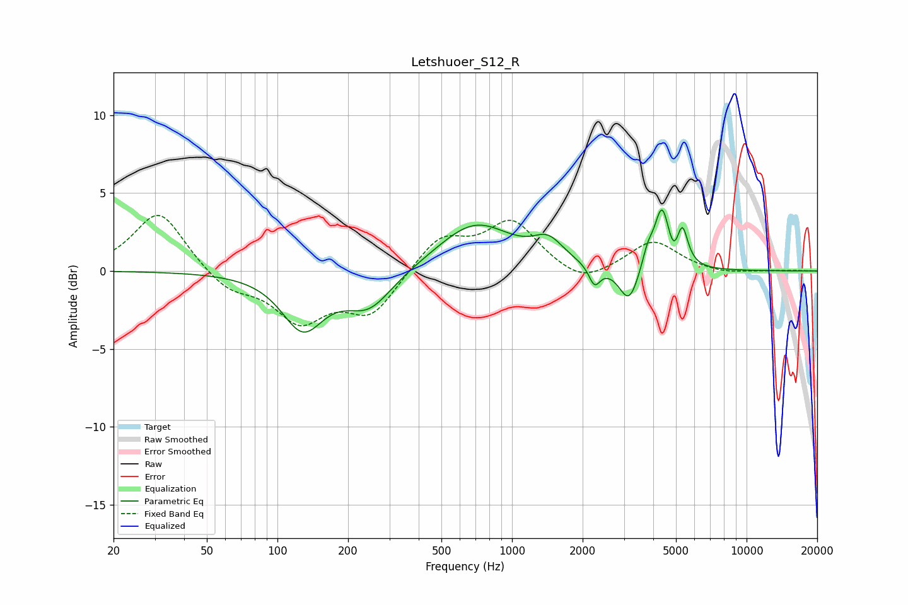

# Letshuoer_S12_R
See [usage instructions](https://github.com/jaakkopasanen/AutoEq#usage) for more options and info.

### Parametric EQs
Apply preamp of -4.0 dB when using parametric equalizer.

|   # | Type    |   Fc (Hz) |    Q |   Gain (dB) |
|-----|---------|-----------|------|-------------|
|   1 | Peaking |       128 | 1.58 |        -3.5 |
|   2 | Peaking |       245 | 1.38 |        -2.3 |
|   3 | Peaking |       696 | 0.9  |         3.1 |
|   4 | Peaking |      1428 | 2.22 |         1.4 |
|   5 | Peaking |      2247 | 5.85 |        -1.3 |
|   6 | Peaking |      3153 | 3.39 |        -2.3 |
|   7 | Peaking |      3787 | 6    |         1.1 |
|   8 | Peaking |      4358 | 4.4  |         3.9 |
|   9 | Peaking |      4887 | 6    |        -0.9 |
|  10 | Peaking |      5325 | 6    |         2.4 |

### Fixed Band EQs
When using fixed band (also called graphic) equalizer, apply preamp of **-3.7 dB** (if available) and set gains manually with these parameters.

|   # | Type    |   Fc (Hz) |    Q |   Gain (dB) |
|-----|---------|-----------|------|-------------|
|   1 | Peaking |        31 | 1.41 |         3.9 |
|   2 | Peaking |        62 | 1.41 |        -1.3 |
|   3 | Peaking |       125 | 1.41 |        -3   |
|   4 | Peaking |       250 | 1.41 |        -2.7 |
|   5 | Peaking |       500 | 1.41 |         2.2 |
|   6 | Peaking |      1000 | 1.41 |         3.1 |
|   7 | Peaking |      2000 | 1.41 |        -1   |
|   8 | Peaking |      4000 | 1.41 |         1.9 |
|   9 | Peaking |      8000 | 1.41 |        -0.2 |
|  10 | Peaking |     16000 | 1.41 |         0   |

### Graphs

