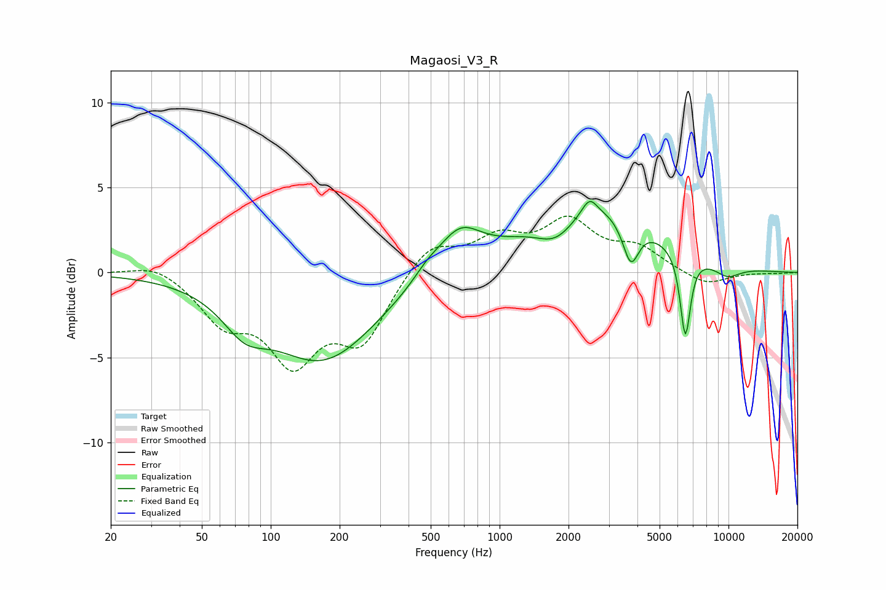

# Magaosi_V3_R
See [usage instructions](https://github.com/jaakkopasanen/AutoEq#usage) for more options and info.

### Parametric EQs
Apply preamp of -4.3 dB when using parametric equalizer.

|   # | Type    |   Fc (Hz) |    Q |   Gain (dB) |
|-----|---------|-----------|------|-------------|
|   1 | Peaking |        77 | 1.48 |        -1.8 |
|   2 | Peaking |       169 | 0.61 |        -5.1 |
|   3 | Peaking |       480 | 2.29 |         0.6 |
|   4 | Peaking |       668 | 1.48 |         2.4 |
|   5 | Peaking |      1768 | 1.59 |        -1.7 |
|   6 | Peaking |      2469 | 4.39 |         0.9 |
|   7 | Peaking |      2473 | 0.52 |         4.2 |
|   8 | Peaking |      3742 | 3.96 |        -2.6 |
|   9 | Peaking |      6478 | 6    |        -5   |
|  10 | Peaking |      9865 | 2.04 |        -0.7 |

### Fixed Band EQs
When using fixed band (also called graphic) equalizer, apply preamp of **-3.4 dB** (if available) and set gains manually with these parameters.

|   # | Type    |   Fc (Hz) |    Q |   Gain (dB) |
|-----|---------|-----------|------|-------------|
|   1 | Peaking |        31 | 1.41 |         0.7 |
|   2 | Peaking |        62 | 1.41 |        -2.6 |
|   3 | Peaking |       125 | 1.41 |        -4.8 |
|   4 | Peaking |       250 | 1.41 |        -3.8 |
|   5 | Peaking |       500 | 1.41 |         1.8 |
|   6 | Peaking |      1000 | 1.41 |         1.8 |
|   7 | Peaking |      2000 | 1.41 |         2.8 |
|   8 | Peaking |      4000 | 1.41 |         1.3 |
|   9 | Peaking |      8000 | 1.41 |        -0.8 |
|  10 | Peaking |     16000 | 1.41 |        -0   |

### Graphs

