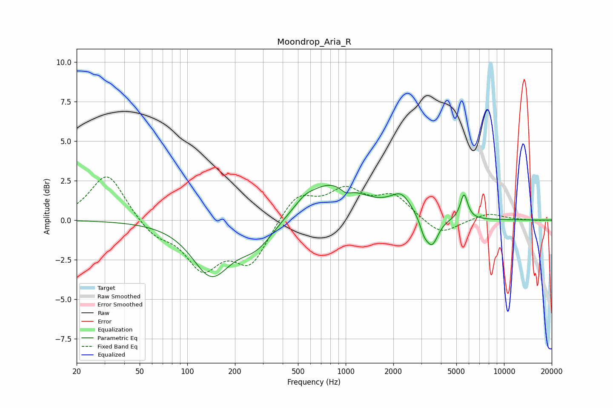

# Moondrop_Aria_R
See [usage instructions](https://github.com/jaakkopasanen/AutoEq#usage) for more options and info.

### Parametric EQs
Apply preamp of -2.3 dB when using parametric equalizer.

|   # | Type    |   Fc (Hz) |    Q |   Gain (dB) |
|-----|---------|-----------|------|-------------|
|   1 | Peaking |       141 | 1.19 |        -3.3 |
|   2 | Peaking |       274 | 1.19 |        -1.6 |
|   3 | Peaking |       551 | 2.85 |         0.3 |
|   4 | Peaking |       810 | 0.73 |         2.5 |
|   5 | Peaking |      1000 | 3.8  |        -0.4 |
|   6 | Peaking |      1907 | 1.77 |         0.2 |
|   7 | Peaking |      2262 | 2.31 |         1.1 |
|   8 | Peaking |      3119 | 5.82 |        -0.6 |
|   9 | Peaking |      3502 | 3.46 |        -1.8 |
|  10 | Peaking |      5590 | 6    |         1.6 |

### Fixed Band EQs
When using fixed band (also called graphic) equalizer, apply preamp of **-2.8 dB** (if available) and set gains manually with these parameters.

|   # | Type    |   Fc (Hz) |    Q |   Gain (dB) |
|-----|---------|-----------|------|-------------|
|   1 | Peaking |        31 | 1.41 |         3   |
|   2 | Peaking |        62 | 1.41 |        -1   |
|   3 | Peaking |       125 | 1.41 |        -2.8 |
|   4 | Peaking |       250 | 1.41 |        -2.7 |
|   5 | Peaking |       500 | 1.41 |         1.7 |
|   6 | Peaking |      1000 | 1.41 |         1.7 |
|   7 | Peaking |      2000 | 1.41 |         1.5 |
|   8 | Peaking |      4000 | 1.41 |        -1   |
|   9 | Peaking |      8000 | 1.41 |         0.4 |
|  10 | Peaking |     16000 | 1.41 |        -0   |

### Graphs

