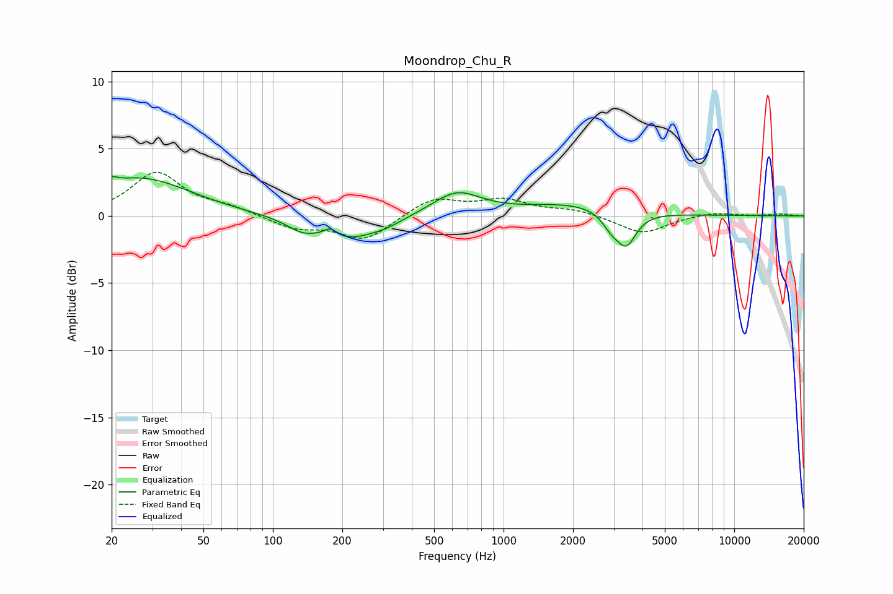

# Moondrop_Chu_R
See [usage instructions](https://github.com/jaakkopasanen/AutoEq#usage) for more options and info.

### Parametric EQs
Apply preamp of -3.0 dB when using parametric equalizer.

|   # | Type    |   Fc (Hz) |    Q |   Gain (dB) |
|-----|---------|-----------|------|-------------|
|   1 | Peaking |        20 | 5.89 |         0.4 |
|   2 | Peaking |        26 | 0.65 |         2.8 |
|   3 | Peaking |       133 | 2.32 |        -0.6 |
|   4 | Peaking |       177 | 4.97 |         0.7 |
|   5 | Peaking |       208 | 0.97 |        -1.8 |
|   6 | Peaking |       310 | 2.27 |        -0.3 |
|   7 | Peaking |       626 | 1.34 |         1.8 |
|   8 | Peaking |      2013 | 0.65 |         0.9 |
|   9 | Peaking |      2925 | 3.61 |        -1   |
|  10 | Peaking |      3403 | 3.27 |        -2.4 |

### Fixed Band EQs
When using fixed band (also called graphic) equalizer, apply preamp of **-3.3 dB** (if available) and set gains manually with these parameters.

|   # | Type    |   Fc (Hz) |    Q |   Gain (dB) |
|-----|---------|-----------|------|-------------|
|   1 | Peaking |        31 | 1.41 |         3.2 |
|   2 | Peaking |        62 | 1.41 |         0.6 |
|   3 | Peaking |       125 | 1.41 |        -0.9 |
|   4 | Peaking |       250 | 1.41 |        -1.8 |
|   5 | Peaking |       500 | 1.41 |         1.3 |
|   6 | Peaking |      1000 | 1.41 |         1.1 |
|   7 | Peaking |      2000 | 1.41 |         0.4 |
|   8 | Peaking |      4000 | 1.41 |        -1.3 |
|   9 | Peaking |      8000 | 1.41 |         0.3 |
|  10 | Peaking |     16000 | 1.41 |         0.1 |

### Graphs

