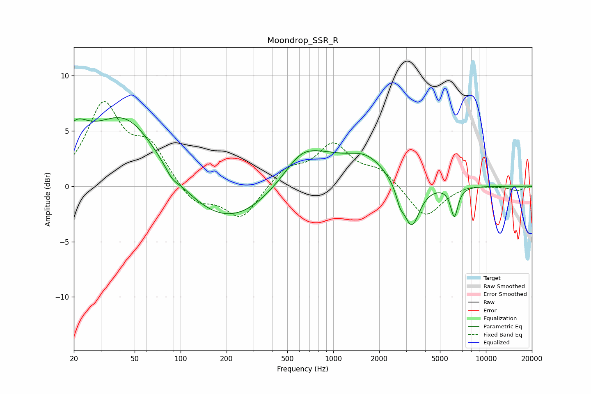

# Moondrop_SSR_R
See [usage instructions](https://github.com/jaakkopasanen/AutoEq#usage) for more options and info.

### Parametric EQs
Apply preamp of -6.3 dB when using parametric equalizer.

|   # | Type    |   Fc (Hz) |    Q |   Gain (dB) |
|-----|---------|-----------|------|-------------|
|   1 | Peaking |        20 | 1.67 |         3   |
|   2 | Peaking |        44 | 0.62 |         6.6 |
|   3 | Peaking |        88 | 3.5  |        -0.6 |
|   4 | Peaking |       207 | 0.43 |        -4.1 |
|   5 | Peaking |       610 | 1.6  |         0.9 |
|   6 | Peaking |       704 | 0.63 |         3.5 |
|   7 | Peaking |      1669 | 1.14 |         1.9 |
|   8 | Peaking |      2732 | 5.93 |        -1.1 |
|   9 | Peaking |      3253 | 2.64 |        -4.1 |
|  10 | Peaking |      6208 | 5.71 |        -2.7 |

### Fixed Band EQs
When using fixed band (also called graphic) equalizer, apply preamp of **-7.7 dB** (if available) and set gains manually with these parameters.

|   # | Type    |   Fc (Hz) |    Q |   Gain (dB) |
|-----|---------|-----------|------|-------------|
|   1 | Peaking |        31 | 1.41 |         7.1 |
|   2 | Peaking |        62 | 1.41 |         3.3 |
|   3 | Peaking |       125 | 1.41 |        -1.8 |
|   4 | Peaking |       250 | 1.41 |        -3   |
|   5 | Peaking |       500 | 1.41 |         1.6 |
|   6 | Peaking |      1000 | 1.41 |         3.6 |
|   7 | Peaking |      2000 | 1.41 |         1.4 |
|   8 | Peaking |      4000 | 1.41 |        -2.9 |
|   9 | Peaking |      8000 | 1.41 |         0.2 |
|  10 | Peaking |     16000 | 1.41 |        -0.4 |

### Graphs

