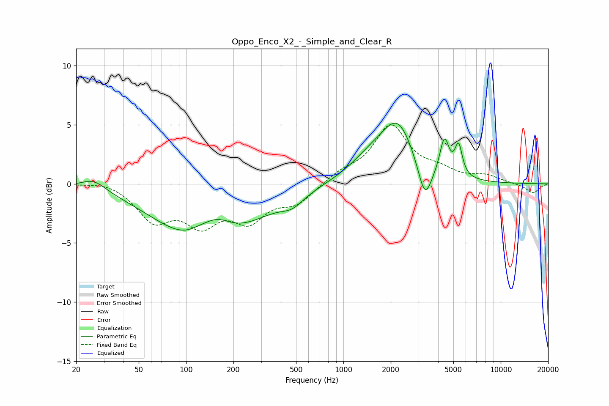

# Oppo_Enco_X2_-_Simple_and_Clear_R
See [usage instructions](https://github.com/jaakkopasanen/AutoEq#usage) for more options and info.

### Parametric EQs
Apply preamp of -5.2 dB when using parametric equalizer.

|   # | Type    |   Fc (Hz) |    Q |   Gain (dB) |
|-----|---------|-----------|------|-------------|
|   1 | Peaking |        26 | 1.79 |         1   |
|   2 | Peaking |       119 | 2.23 |         0.4 |
|   3 | Peaking |       138 | 0.48 |        -5.7 |
|   4 | Peaking |       155 | 1.32 |         2.4 |
|   5 | Peaking |       474 | 1.98 |        -0.8 |
|   6 | Peaking |      1534 | 0.97 |         1.9 |
|   7 | Peaking |      2232 | 1.4  |         4.3 |
|   8 | Peaking |      3297 | 3.24 |        -3.1 |
|   9 | Peaking |      4385 | 4.79 |         3.1 |
|  10 | Peaking |      5395 | 6    |         2.6 |

### Fixed Band EQs
When using fixed band (also called graphic) equalizer, apply preamp of **-5.1 dB** (if available) and set gains manually with these parameters.

|   # | Type    |   Fc (Hz) |    Q |   Gain (dB) |
|-----|---------|-----------|------|-------------|
|   1 | Peaking |        31 | 1.41 |         0.3 |
|   2 | Peaking |        62 | 1.41 |        -2.9 |
|   3 | Peaking |       125 | 1.41 |        -3   |
|   4 | Peaking |       250 | 1.41 |        -2.7 |
|   5 | Peaking |       500 | 1.41 |        -1.5 |
|   6 | Peaking |      1000 | 1.41 |         0.8 |
|   7 | Peaking |      2000 | 1.41 |         4.8 |
|   8 | Peaking |      4000 | 1.41 |         0.9 |
|   9 | Peaking |      8000 | 1.41 |         0.6 |
|  10 | Peaking |     16000 | 1.41 |        -0.8 |

### Graphs

