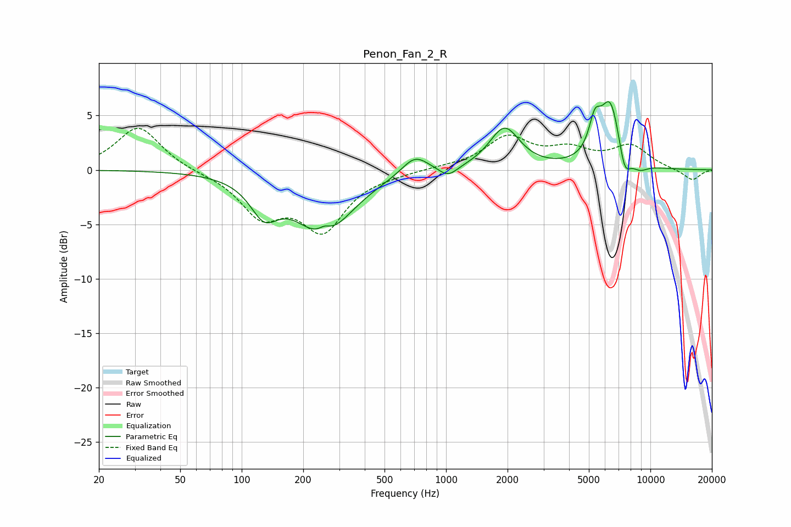

# Penon_Fan_2_R
See [usage instructions](https://github.com/jaakkopasanen/AutoEq#usage) for more options and info.

### Parametric EQs
Apply preamp of -6.4 dB when using parametric equalizer.

|   # | Type    |   Fc (Hz) |    Q |   Gain (dB) |
|-----|---------|-----------|------|-------------|
|   1 | Peaking |       129 | 2.11 |        -3   |
|   2 | Peaking |       252 | 1.01 |        -5.7 |
|   3 | Peaking |       254 | 4.62 |         0.7 |
|   4 | Peaking |       704 | 2.16 |         1.7 |
|   5 | Peaking |      1023 | 3.16 |        -0.9 |
|   6 | Peaking |      1933 | 1.92 |         3.8 |
|   7 | Peaking |      5345 | 4.93 |         2.7 |
|   8 | Peaking |      6373 | 2.64 |         6.2 |
|   9 | Peaking |      7467 | 4.48 |        -2.6 |
|  10 | Peaking |      8829 | 3.17 |        -0.7 |

### Fixed Band EQs
When using fixed band (also called graphic) equalizer, apply preamp of **-3.9 dB** (if available) and set gains manually with these parameters.

|   # | Type    |   Fc (Hz) |    Q |   Gain (dB) |
|-----|---------|-----------|------|-------------|
|   1 | Peaking |        31 | 1.41 |         4   |
|   2 | Peaking |        62 | 1.41 |        -0.2 |
|   3 | Peaking |       125 | 1.41 |        -3.9 |
|   4 | Peaking |       250 | 1.41 |        -5.2 |
|   5 | Peaking |       500 | 1.41 |        -0.2 |
|   6 | Peaking |      1000 | 1.41 |         0.2 |
|   7 | Peaking |      2000 | 1.41 |         2.9 |
|   8 | Peaking |      4000 | 1.41 |         1.6 |
|   9 | Peaking |      8000 | 1.41 |         2.1 |
|  10 | Peaking |     16000 | 1.41 |        -1   |

### Graphs

