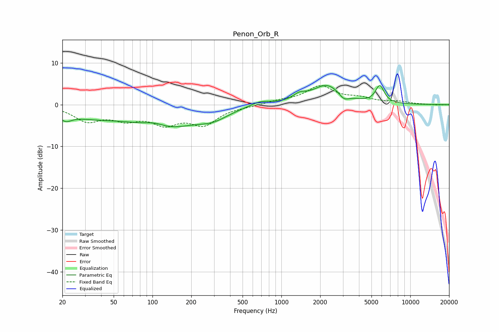

# Penon_Orb_R
See [usage instructions](https://github.com/jaakkopasanen/AutoEq#usage) for more options and info.

### Parametric EQs
Apply preamp of -4.7 dB when using parametric equalizer.

|   # | Type    |   Fc (Hz) |    Q |   Gain (dB) |
|-----|---------|-----------|------|-------------|
|   1 | Peaking |        21 | 3.15 |        -1.7 |
|   2 | Peaking |        33 | 0.55 |        -2.6 |
|   3 | Peaking |       104 | 1.73 |         1.2 |
|   4 | Peaking |       129 | 0.6  |        -5   |
|   5 | Peaking |       296 | 1.19 |        -2.1 |
|   6 | Peaking |       682 | 1.8  |         1.1 |
|   7 | Peaking |      1381 | 2.82 |         1.4 |
|   8 | Peaking |      2265 | 1.23 |         4.7 |
|   9 | Peaking |      3049 | 3.61 |        -1.6 |
|  10 | Peaking |      5799 | 4.15 |         4.1 |

### Fixed Band EQs
When using fixed band (also called graphic) equalizer, apply preamp of **-4.7 dB** (if available) and set gains manually with these parameters.

|   # | Type    |   Fc (Hz) |    Q |   Gain (dB) |
|-----|---------|-----------|------|-------------|
|   1 | Peaking |        31 | 1.41 |        -3.6 |
|   2 | Peaking |        62 | 1.41 |        -2.9 |
|   3 | Peaking |       125 | 1.41 |        -3.9 |
|   4 | Peaking |       250 | 1.41 |        -4.4 |
|   5 | Peaking |       500 | 1.41 |        -0.3 |
|   6 | Peaking |      1000 | 1.41 |         0.8 |
|   7 | Peaking |      2000 | 1.41 |         4.2 |
|   8 | Peaking |      4000 | 1.41 |         1.3 |
|   9 | Peaking |      8000 | 1.41 |         0.6 |
|  10 | Peaking |     16000 | 1.41 |        -0.1 |

### Graphs

