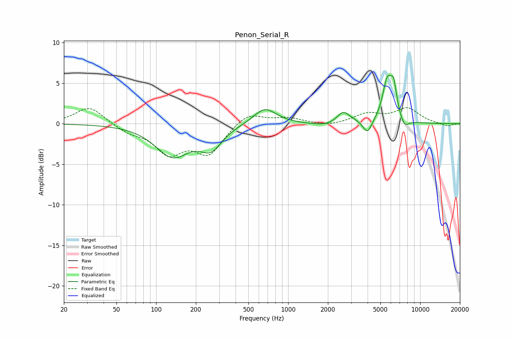

# Penon_Serial_R
See [usage instructions](https://github.com/jaakkopasanen/AutoEq#usage) for more options and info.

### Parametric EQs
Apply preamp of -6.1 dB when using parametric equalizer.

|   # | Type    |   Fc (Hz) |    Q |   Gain (dB) |
|-----|---------|-----------|------|-------------|
|   1 | Peaking |       133 | 1.1  |        -3.9 |
|   2 | Peaking |       261 | 1.71 |        -2.6 |
|   3 | Peaking |       666 | 1.62 |         2   |
|   4 | Peaking |      1923 | 1.37 |        -0.4 |
|   5 | Peaking |      2600 | 3.19 |         1.2 |
|   6 | Peaking |      2927 | 1.96 |         0.4 |
|   7 | Peaking |      3990 | 4.14 |        -1.7 |
|   8 | Peaking |      5642 | 3.78 |         5   |
|   9 | Peaking |      6308 | 5.82 |         3.2 |
|  10 | Peaking |      7625 | 4.3  |        -1   |

### Fixed Band EQs
When using fixed band (also called graphic) equalizer, apply preamp of **-2.1 dB** (if available) and set gains manually with these parameters.

|   # | Type    |   Fc (Hz) |    Q |   Gain (dB) |
|-----|---------|-----------|------|-------------|
|   1 | Peaking |        31 | 1.41 |         2.2 |
|   2 | Peaking |        62 | 1.41 |        -0.9 |
|   3 | Peaking |       125 | 1.41 |        -3.4 |
|   4 | Peaking |       250 | 1.41 |        -3.5 |
|   5 | Peaking |       500 | 1.41 |         1.5 |
|   6 | Peaking |      1000 | 1.41 |         0.7 |
|   7 | Peaking |      2000 | 1.41 |        -0.4 |
|   8 | Peaking |      4000 | 1.41 |         1.1 |
|   9 | Peaking |      8000 | 1.41 |         1.8 |
|  10 | Peaking |     16000 | 1.41 |        -0.3 |

### Graphs

