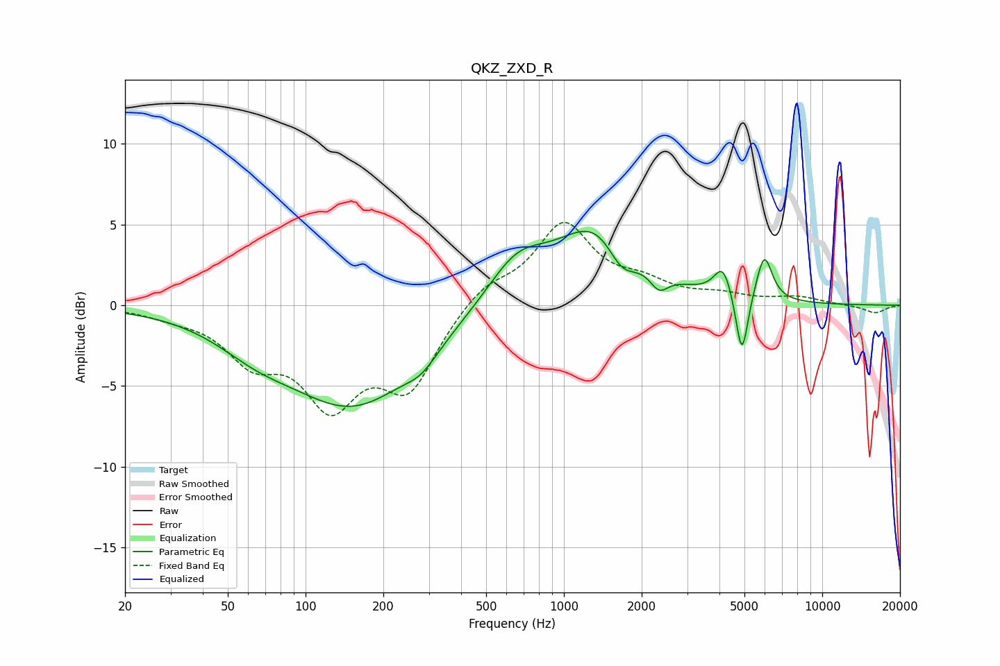

# QKZ_ZXD_R
See [usage instructions](https://github.com/jaakkopasanen/AutoEq#usage) for more options and info.

### Parametric EQs
Apply preamp of -4.7 dB when using parametric equalizer.

|   # | Type    |   Fc (Hz) |    Q |   Gain (dB) |
|-----|---------|-----------|------|-------------|
|   1 | Peaking |        64 | 0.92 |        -1.4 |
|   2 | Peaking |       154 | 0.56 |        -6   |
|   3 | Peaking |       281 | 2.18 |        -0.9 |
|   4 | Peaking |       656 | 1.2  |         2.7 |
|   5 | Peaking |      1387 | 0.89 |         5.1 |
|   6 | Peaking |      1674 | 2.3  |        -2.2 |
|   7 | Peaking |      2334 | 3.96 |        -1.2 |
|   8 | Peaking |      4129 | 4.12 |         1.9 |
|   9 | Peaking |      4888 | 6    |        -4.1 |
|  10 | Peaking |      5963 | 4.51 |         2.9 |

### Fixed Band EQs
When using fixed band (also called graphic) equalizer, apply preamp of **-5.2 dB** (if available) and set gains manually with these parameters.

|   # | Type    |   Fc (Hz) |    Q |   Gain (dB) |
|-----|---------|-----------|------|-------------|
|   1 | Peaking |        31 | 1.41 |        -0.5 |
|   2 | Peaking |        62 | 1.41 |        -2.9 |
|   3 | Peaking |       125 | 1.41 |        -5.5 |
|   4 | Peaking |       250 | 1.41 |        -4.8 |
|   5 | Peaking |       500 | 1.41 |         1.3 |
|   6 | Peaking |      1000 | 1.41 |         4.9 |
|   7 | Peaking |      2000 | 1.41 |         1.1 |
|   8 | Peaking |      4000 | 1.41 |         0.5 |
|   9 | Peaking |      8000 | 1.41 |         0.5 |
|  10 | Peaking |     16000 | 1.41 |        -0.5 |

### Graphs

