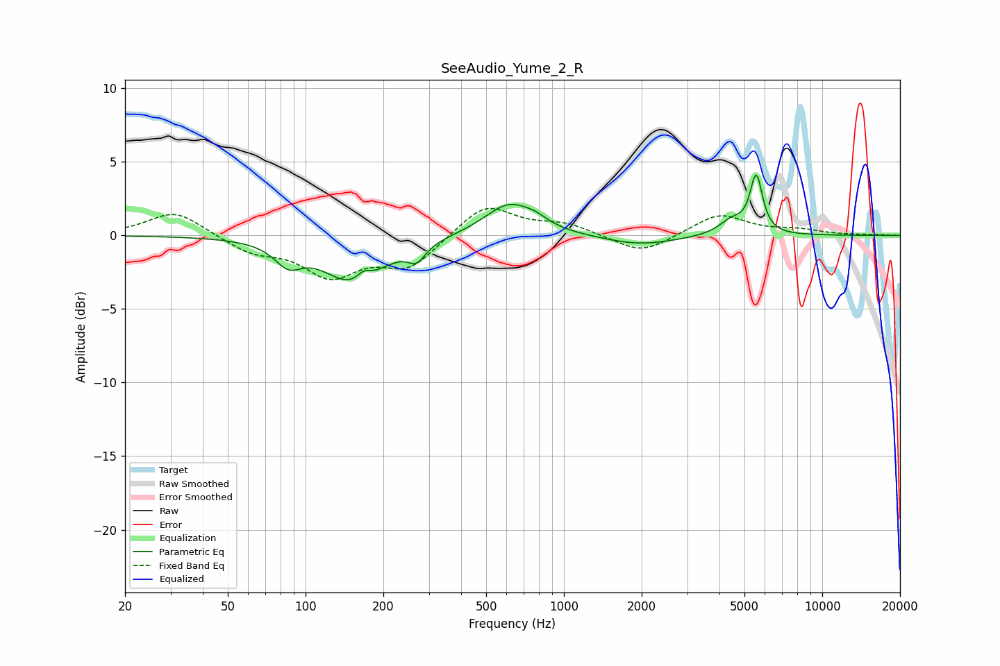

# SeeAudio_Yume_2_R
See [usage instructions](https://github.com/jaakkopasanen/AutoEq#usage) for more options and info.

### Parametric EQs
Apply preamp of -4.2 dB when using parametric equalizer.

|   # | Type    |   Fc (Hz) |    Q |   Gain (dB) |
|-----|---------|-----------|------|-------------|
|   1 | Peaking |        86 | 2.75 |        -1.4 |
|   2 | Peaking |       155 | 1.21 |        -3.2 |
|   3 | Peaking |       168 | 4.73 |         0.7 |
|   4 | Peaking |       269 | 4.15 |        -1.1 |
|   5 | Peaking |       617 | 1.47 |         2.2 |
|   6 | Peaking |       782 | 3.28 |         0.3 |
|   7 | Peaking |      1969 | 1.01 |        -0.7 |
|   8 | Peaking |      4467 | 2.81 |         1   |
|   9 | Peaking |      5546 | 5.88 |         2.6 |
|  10 | Peaking |      5573 | 5.97 |         1.2 |

### Fixed Band EQs
When using fixed band (also called graphic) equalizer, apply preamp of **-1.9 dB** (if available) and set gains manually with these parameters.

|   # | Type    |   Fc (Hz) |    Q |   Gain (dB) |
|-----|---------|-----------|------|-------------|
|   1 | Peaking |        31 | 1.41 |         1.7 |
|   2 | Peaking |        62 | 1.41 |        -1   |
|   3 | Peaking |       125 | 1.41 |        -2.6 |
|   4 | Peaking |       250 | 1.41 |        -2.1 |
|   5 | Peaking |       500 | 1.41 |         2.2 |
|   6 | Peaking |      1000 | 1.41 |         0.7 |
|   7 | Peaking |      2000 | 1.41 |        -1.3 |
|   8 | Peaking |      4000 | 1.41 |         1.5 |
|   9 | Peaking |      8000 | 1.41 |         0.3 |
|  10 | Peaking |     16000 | 1.41 |         0   |

### Graphs

