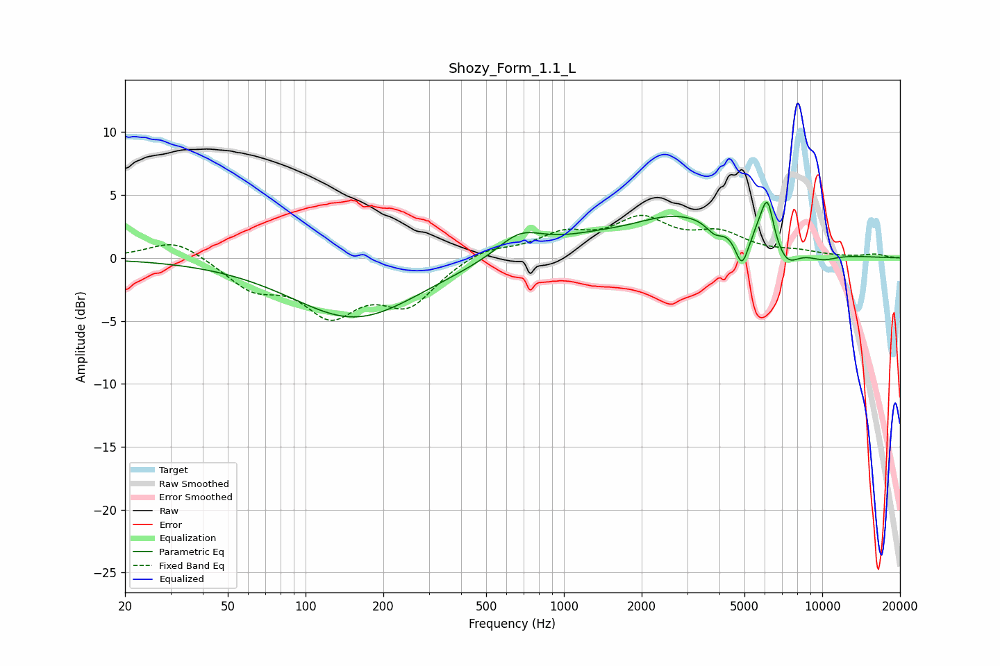

# Shozy_Form_1.1_L
See [usage instructions](https://github.com/jaakkopasanen/AutoEq#usage) for more options and info.

### Parametric EQs
Apply preamp of -4.5 dB when using parametric equalizer.

|   # | Type    |   Fc (Hz) |    Q |   Gain (dB) |
|-----|---------|-----------|------|-------------|
|   1 | Peaking |       156 | 0.58 |        -4.8 |
|   2 | Peaking |       675 | 1.63 |         1.7 |
|   3 | Peaking |      1807 | 1.04 |        -0.8 |
|   4 | Peaking |      2531 | 0.48 |         3.9 |
|   5 | Peaking |      3834 | 4.11 |        -0.9 |
|   6 | Peaking |      4891 | 5.24 |        -2.9 |
|   7 | Peaking |      5804 | 4.35 |         0.9 |
|   8 | Peaking |      6149 | 5.98 |         3.1 |
|   9 | Peaking |      7292 | 2.85 |        -1.7 |
|  10 | Peaking |     10000 | 2.01 |        -0.6 |

### Fixed Band EQs
When using fixed band (also called graphic) equalizer, apply preamp of **-3.5 dB** (if available) and set gains manually with these parameters.

|   # | Type    |   Fc (Hz) |    Q |   Gain (dB) |
|-----|---------|-----------|------|-------------|
|   1 | Peaking |        31 | 1.41 |         1.6 |
|   2 | Peaking |        62 | 1.41 |        -2.2 |
|   3 | Peaking |       125 | 1.41 |        -4   |
|   4 | Peaking |       250 | 1.41 |        -3.4 |
|   5 | Peaking |       500 | 1.41 |         0.9 |
|   6 | Peaking |      1000 | 1.41 |         1.7 |
|   7 | Peaking |      2000 | 1.41 |         2.8 |
|   8 | Peaking |      4000 | 1.41 |         1.7 |
|   9 | Peaking |      8000 | 1.41 |         0.4 |
|  10 | Peaking |     16000 | 1.41 |         0.3 |

### Graphs

