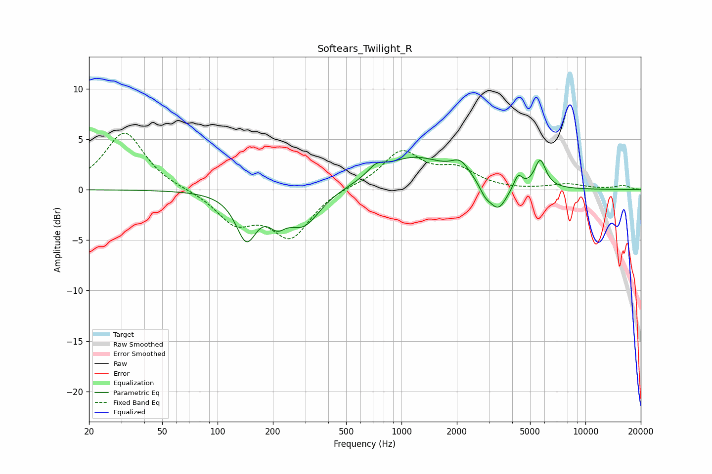

# Softears_Twilight_R
See [usage instructions](https://github.com/jaakkopasanen/AutoEq#usage) for more options and info.

### Parametric EQs
Apply preamp of -3.3 dB when using parametric equalizer.

|   # | Type    |   Fc (Hz) |    Q |   Gain (dB) |
|-----|---------|-----------|------|-------------|
|   1 | Peaking |       143 | 2.54 |        -4.5 |
|   2 | Peaking |       211 | 3    |        -1.8 |
|   3 | Peaking |       294 | 1.58 |        -3.4 |
|   4 | Peaking |       728 | 3.14 |         0.9 |
|   5 | Peaking |      1176 | 0.78 |         3.1 |
|   6 | Peaking |      2095 | 2.78 |         1.5 |
|   7 | Peaking |      2851 | 4.88 |        -0.8 |
|   8 | Peaking |      3345 | 2.91 |        -2.5 |
|   9 | Peaking |      4300 | 6    |         1.4 |
|  10 | Peaking |      5678 | 4.45 |         2.8 |

### Fixed Band EQs
When using fixed band (also called graphic) equalizer, apply preamp of **-5.7 dB** (if available) and set gains manually with these parameters.

|   # | Type    |   Fc (Hz) |    Q |   Gain (dB) |
|-----|---------|-----------|------|-------------|
|   1 | Peaking |        31 | 1.41 |         5.7 |
|   2 | Peaking |        62 | 1.41 |         0   |
|   3 | Peaking |       125 | 1.41 |        -3.1 |
|   4 | Peaking |       250 | 1.41 |        -4.5 |
|   5 | Peaking |       500 | 1.41 |         0.3 |
|   6 | Peaking |      1000 | 1.41 |         3.7 |
|   7 | Peaking |      2000 | 1.41 |         1.8 |
|   8 | Peaking |      4000 | 1.41 |        -0.1 |
|   9 | Peaking |      8000 | 1.41 |         0.5 |
|  10 | Peaking |     16000 | 1.41 |         0.4 |

### Graphs

