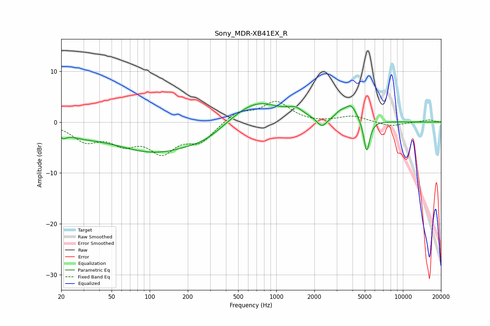

# Sony_MDR-XB41EX_R
See [usage instructions](https://github.com/jaakkopasanen/AutoEq#usage) for more options and info.

### Parametric EQs
Apply preamp of -3.7 dB when using parametric equalizer.

|   # | Type    |   Fc (Hz) |    Q |   Gain (dB) |
|-----|---------|-----------|------|-------------|
|   1 | Peaking |        21 | 5.81 |        -1.1 |
|   2 | Peaking |        28 | 0.85 |        -1.5 |
|   3 | Peaking |       113 | 0.41 |        -5.8 |
|   4 | Peaking |       278 | 1.09 |        -1.3 |
|   5 | Peaking |       695 | 0.72 |         4.5 |
|   6 | Peaking |      1421 | 2.48 |         1.3 |
|   7 | Peaking |      2290 | 3.68 |        -1.9 |
|   8 | Peaking |      3166 | 3.97 |         1   |
|   9 | Peaking |      3881 | 2.83 |         3.2 |
|  10 | Peaking |      5179 | 6    |        -6.5 |

### Fixed Band EQs
When using fixed band (also called graphic) equalizer, apply preamp of **-4.2 dB** (if available) and set gains manually with these parameters.

|   # | Type    |   Fc (Hz) |    Q |   Gain (dB) |
|-----|---------|-----------|------|-------------|
|   1 | Peaking |        31 | 1.41 |        -3.4 |
|   2 | Peaking |        62 | 1.41 |        -3.5 |
|   3 | Peaking |       125 | 1.41 |        -5.3 |
|   4 | Peaking |       250 | 1.41 |        -3.5 |
|   5 | Peaking |       500 | 1.41 |         2.1 |
|   6 | Peaking |      1000 | 1.41 |         3.9 |
|   7 | Peaking |      2000 | 1.41 |        -0.2 |
|   8 | Peaking |      4000 | 1.41 |         1.2 |
|   9 | Peaking |      8000 | 1.41 |        -0.9 |
|  10 | Peaking |     16000 | 1.41 |         0.5 |

### Graphs

