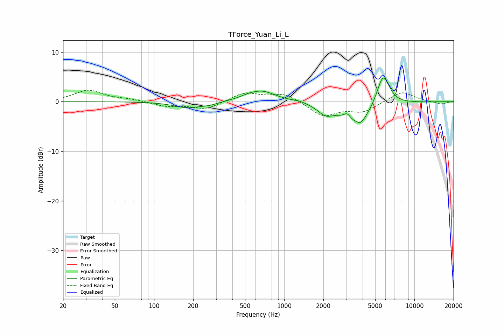

# TForce_Yuan_Li_L
See [usage instructions](https://github.com/jaakkopasanen/AutoEq#usage) for more options and info.

### Parametric EQs
Apply preamp of -4.9 dB when using parametric equalizer.

|   # | Type    |   Fc (Hz) |    Q |   Gain (dB) |
|-----|---------|-----------|------|-------------|
|   1 | Peaking |       180 | 1.37 |        -1.2 |
|   2 | Peaking |       267 | 2.24 |        -0.5 |
|   3 | Peaking |       524 | 2.39 |         0.3 |
|   4 | Peaking |       672 | 1.32 |         2.2 |
|   5 | Peaking |      1299 | 2.7  |         0.3 |
|   6 | Peaking |      2072 | 2.49 |        -1.8 |
|   7 | Peaking |      3044 | 5.92 |         1.1 |
|   8 | Peaking |      3688 | 1.12 |        -4.3 |
|   9 | Peaking |      3886 | 4.63 |        -1   |
|  10 | Peaking |      5745 | 2.74 |         6.8 |

### Fixed Band EQs
When using fixed band (also called graphic) equalizer, apply preamp of **-2.4 dB** (if available) and set gains manually with these parameters.

|   # | Type    |   Fc (Hz) |    Q |   Gain (dB) |
|-----|---------|-----------|------|-------------|
|   1 | Peaking |        31 | 1.41 |         2.3 |
|   2 | Peaking |        62 | 1.41 |         0.4 |
|   3 | Peaking |       125 | 1.41 |        -0.9 |
|   4 | Peaking |       250 | 1.41 |        -1.5 |
|   5 | Peaking |       500 | 1.41 |         1.8 |
|   6 | Peaking |      1000 | 1.41 |         1.7 |
|   7 | Peaking |      2000 | 1.41 |        -2.9 |
|   8 | Peaking |      4000 | 1.41 |        -1.9 |
|   9 | Peaking |      8000 | 1.41 |         2.1 |
|  10 | Peaking |     16000 | 1.41 |        -0.5 |

### Graphs

