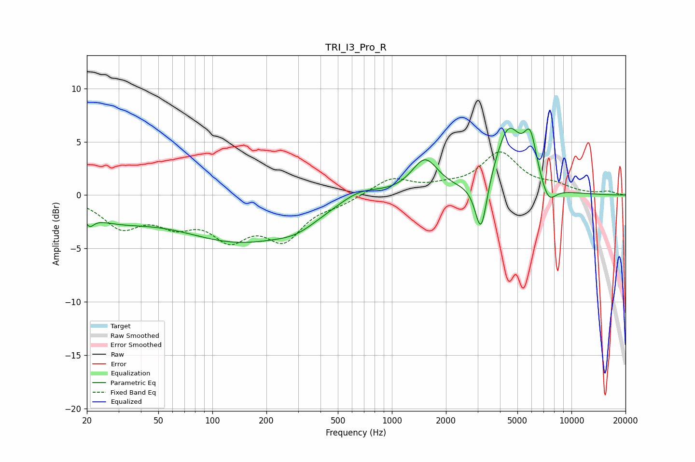

# TRI_I3_Pro_R
See [usage instructions](https://github.com/jaakkopasanen/AutoEq#usage) for more options and info.

### Parametric EQs
Apply preamp of -6.4 dB when using parametric equalizer.

|   # | Type    |   Fc (Hz) |    Q |   Gain (dB) |
|-----|---------|-----------|------|-------------|
|   1 | Peaking |        21 | 5.93 |        -0.9 |
|   2 | Peaking |        28 | 0.67 |        -1.8 |
|   3 | Peaking |       143 | 0.42 |        -4.1 |
|   4 | Peaking |       296 | 1.22 |        -0.9 |
|   5 | Peaking |       660 | 1.24 |         1.1 |
|   6 | Peaking |      1527 | 1.92 |         3.2 |
|   7 | Peaking |      3138 | 4.26 |        -5.2 |
|   8 | Peaking |      4449 | 1.85 |         6.1 |
|   9 | Peaking |      5902 | 3.81 |         4   |
|  10 | Peaking |      7435 | 3.17 |        -1.8 |

### Fixed Band EQs
When using fixed band (also called graphic) equalizer, apply preamp of **-4.1 dB** (if available) and set gains manually with these parameters.

|   # | Type    |   Fc (Hz) |    Q |   Gain (dB) |
|-----|---------|-----------|------|-------------|
|   1 | Peaking |        31 | 1.41 |        -2.8 |
|   2 | Peaking |        62 | 1.41 |        -2.2 |
|   3 | Peaking |       125 | 1.41 |        -3.5 |
|   4 | Peaking |       250 | 1.41 |        -3.7 |
|   5 | Peaking |       500 | 1.41 |        -0.6 |
|   6 | Peaking |      1000 | 1.41 |         1.6 |
|   7 | Peaking |      2000 | 1.41 |         0.5 |
|   8 | Peaking |      4000 | 1.41 |         3.8 |
|   9 | Peaking |      8000 | 1.41 |         0.7 |
|  10 | Peaking |     16000 | 1.41 |         0.3 |

### Graphs

