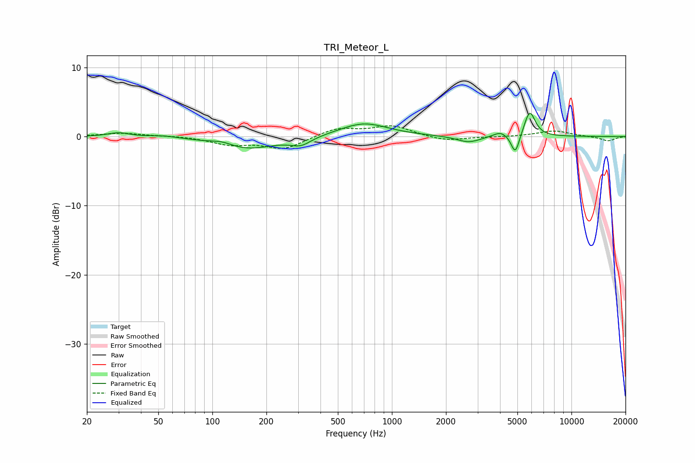

# TRI_Meteor_L
See [usage instructions](https://github.com/jaakkopasanen/AutoEq#usage) for more options and info.

### Parametric EQs
Apply preamp of -3.5 dB when using parametric equalizer.

|   # | Type    |   Fc (Hz) |    Q |   Gain (dB) |
|-----|---------|-----------|------|-------------|
|   1 | Peaking |        30 | 2.47 |         0.6 |
|   2 | Peaking |        54 | 1.82 |         0.3 |
|   3 | Peaking |       114 | 2.27 |         0.6 |
|   4 | Peaking |       154 | 0.87 |        -1.9 |
|   5 | Peaking |       311 | 2.51 |        -1.1 |
|   6 | Peaking |       696 | 1.05 |         2   |
|   7 | Peaking |      2678 | 2.11 |        -0.9 |
|   8 | Peaking |      4031 | 3.48 |         0.8 |
|   9 | Peaking |      4868 | 6    |        -3   |
|  10 | Peaking |      5855 | 4.49 |         3.7 |

### Fixed Band EQs
When using fixed band (also called graphic) equalizer, apply preamp of **-1.6 dB** (if available) and set gains manually with these parameters.

|   # | Type    |   Fc (Hz) |    Q |   Gain (dB) |
|-----|---------|-----------|------|-------------|
|   1 | Peaking |        31 | 1.41 |         0.5 |
|   2 | Peaking |        62 | 1.41 |         0.1 |
|   3 | Peaking |       125 | 1.41 |        -1.1 |
|   4 | Peaking |       250 | 1.41 |        -1.8 |
|   5 | Peaking |       500 | 1.41 |         1.2 |
|   6 | Peaking |      1000 | 1.41 |         1.5 |
|   7 | Peaking |      2000 | 1.41 |        -0.7 |
|   8 | Peaking |      4000 | 1.41 |        -0.1 |
|   9 | Peaking |      8000 | 1.41 |         0.8 |
|  10 | Peaking |     16000 | 1.41 |        -0.7 |

### Graphs

