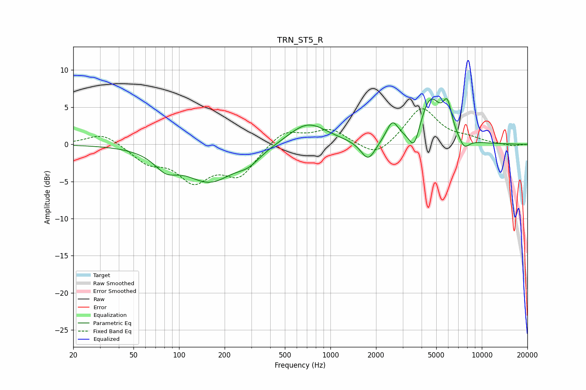

# TRN_ST5_R
See [usage instructions](https://github.com/jaakkopasanen/AutoEq#usage) for more options and info.

### Parametric EQs
Apply preamp of -6.2 dB when using parametric equalizer.

|   # | Type    |   Fc (Hz) |    Q |   Gain (dB) |
|-----|---------|-----------|------|-------------|
|   1 | Peaking |        82 | 1.87 |        -2.1 |
|   2 | Peaking |       159 | 0.85 |        -4.8 |
|   3 | Peaking |       288 | 1.89 |        -1.3 |
|   4 | Peaking |       707 | 1.1  |         3   |
|   5 | Peaking |      1777 | 2.94 |        -2.7 |
|   6 | Peaking |      2564 | 3.63 |         2.6 |
|   7 | Peaking |      3575 | 4.1  |        -3   |
|   8 | Peaking |      4576 | 1.99 |         6   |
|   9 | Peaking |      5926 | 4.61 |         3.8 |
|  10 | Peaking |      7633 | 3.76 |        -1.5 |

### Fixed Band EQs
When using fixed band (also called graphic) equalizer, apply preamp of **-4.9 dB** (if available) and set gains manually with these parameters.

|   # | Type    |   Fc (Hz) |    Q |   Gain (dB) |
|-----|---------|-----------|------|-------------|
|   1 | Peaking |        31 | 1.41 |         1.6 |
|   2 | Peaking |        62 | 1.41 |        -2.2 |
|   3 | Peaking |       125 | 1.41 |        -4.4 |
|   4 | Peaking |       250 | 1.41 |        -4   |
|   5 | Peaking |       500 | 1.41 |         2   |
|   6 | Peaking |      1000 | 1.41 |         2   |
|   7 | Peaking |      2000 | 1.41 |        -2   |
|   8 | Peaking |      4000 | 1.41 |         5   |
|   9 | Peaking |      8000 | 1.41 |         0.7 |
|  10 | Peaking |     16000 | 1.41 |        -0.3 |

### Graphs

