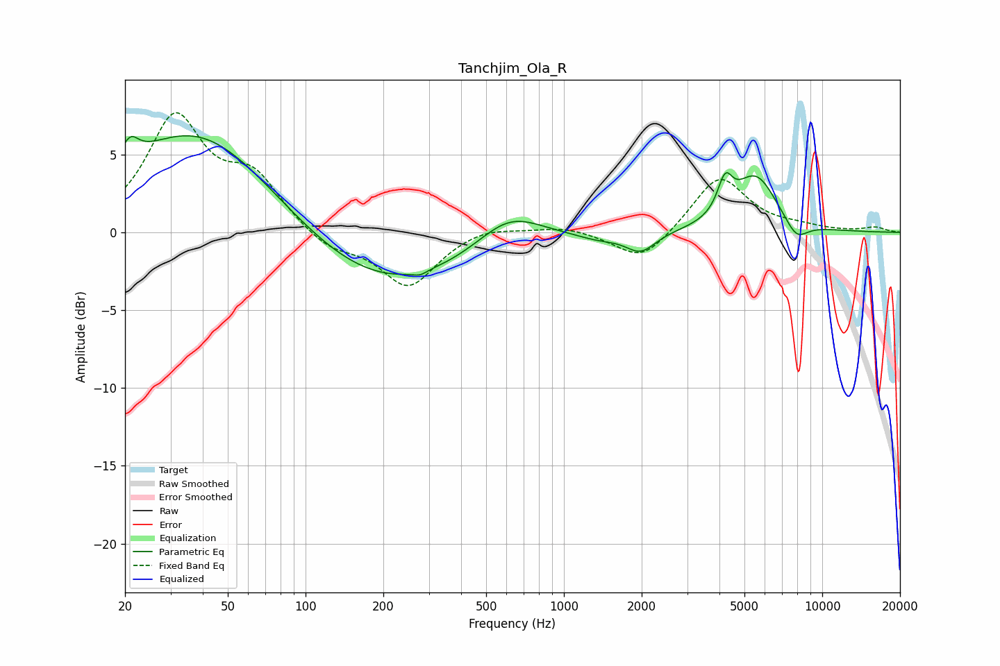

# Tanchjim_Ola_R
See [usage instructions](https://github.com/jaakkopasanen/AutoEq#usage) for more options and info.

### Parametric EQs
Apply preamp of -6.3 dB when using parametric equalizer.

|   # | Type    |   Fc (Hz) |    Q |   Gain (dB) |
|-----|---------|-----------|------|-------------|
|   1 | Peaking |        21 | 4.39 |         1.4 |
|   2 | Peaking |        38 | 0.47 |         6.8 |
|   3 | Peaking |       194 | 0.42 |        -3.9 |
|   4 | Peaking |       277 | 5.89 |        -0.2 |
|   5 | Peaking |       614 | 1.11 |         2.1 |
|   6 | Peaking |      1356 | 1.69 |        -0.4 |
|   7 | Peaking |      1985 | 2.42 |        -1.3 |
|   8 | Peaking |      4207 | 4.92 |         2.1 |
|   9 | Peaking |      5526 | 1.65 |         3.6 |
|  10 | Peaking |      7934 | 2.93 |        -1.2 |

### Fixed Band EQs
When using fixed band (also called graphic) equalizer, apply preamp of **-7.8 dB** (if available) and set gains manually with these parameters.

|   # | Type    |   Fc (Hz) |    Q |   Gain (dB) |
|-----|---------|-----------|------|-------------|
|   1 | Peaking |        31 | 1.41 |         7.2 |
|   2 | Peaking |        62 | 1.41 |         3.2 |
|   3 | Peaking |       125 | 1.41 |        -1.1 |
|   4 | Peaking |       250 | 1.41 |        -3.5 |
|   5 | Peaking |       500 | 1.41 |         0.5 |
|   6 | Peaking |      1000 | 1.41 |         0.4 |
|   7 | Peaking |      2000 | 1.41 |        -2   |
|   8 | Peaking |      4000 | 1.41 |         3.7 |
|   9 | Peaking |      8000 | 1.41 |         0.3 |
|  10 | Peaking |     16000 | 1.41 |         0.3 |

### Graphs

