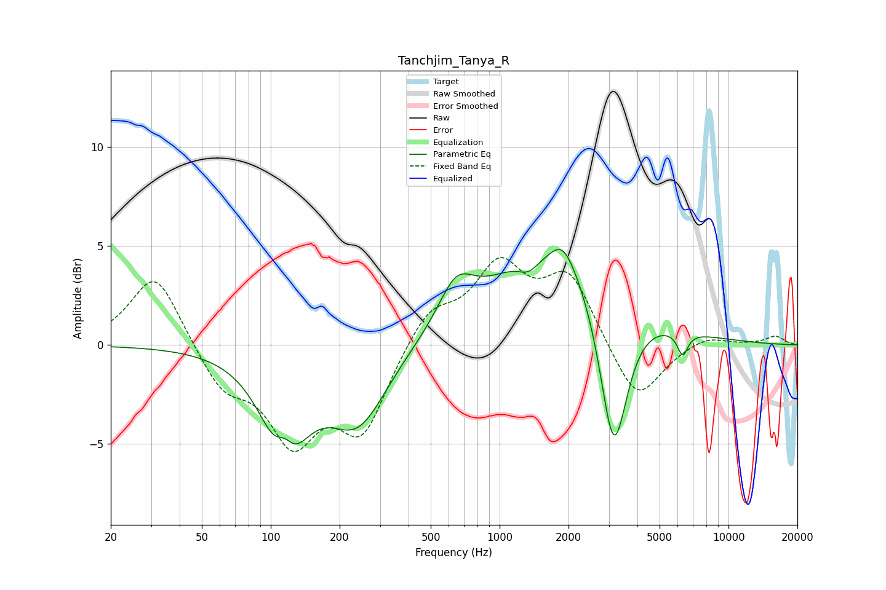

# Tanchjim_Tanya_R
See [usage instructions](https://github.com/jaakkopasanen/AutoEq#usage) for more options and info.

### Parametric EQs
Apply preamp of -4.9 dB when using parametric equalizer.

|   # | Type    |   Fc (Hz) |    Q |   Gain (dB) |
|-----|---------|-----------|------|-------------|
|   1 | Peaking |       115 | 3.26 |         1.9 |
|   2 | Peaking |       115 | 1.56 |        -5.8 |
|   3 | Peaking |       240 | 1.08 |        -3.9 |
|   4 | Peaking |       645 | 1.85 |         2.1 |
|   5 | Peaking |      1340 | 3.11 |        -0.7 |
|   6 | Peaking |      1629 | 2.32 |        -0.2 |
|   7 | Peaking |      1807 | 0.5  |         5.1 |
|   8 | Peaking |      1885 | 2.61 |         1.2 |
|   9 | Peaking |      3150 | 2.26 |        -8.3 |
|  10 | Peaking |      6306 | 5.99 |        -1.2 |

### Fixed Band EQs
When using fixed band (also called graphic) equalizer, apply preamp of **-4.5 dB** (if available) and set gains manually with these parameters.

|   # | Type    |   Fc (Hz) |    Q |   Gain (dB) |
|-----|---------|-----------|------|-------------|
|   1 | Peaking |        31 | 1.41 |         3.7 |
|   2 | Peaking |        62 | 1.41 |        -2.1 |
|   3 | Peaking |       125 | 1.41 |        -4.5 |
|   4 | Peaking |       250 | 1.41 |        -4.2 |
|   5 | Peaking |       500 | 1.41 |         1.8 |
|   6 | Peaking |      1000 | 1.41 |         3.7 |
|   7 | Peaking |      2000 | 1.41 |         3.4 |
|   8 | Peaking |      4000 | 1.41 |        -3   |
|   9 | Peaking |      8000 | 1.41 |         0.5 |
|  10 | Peaking |     16000 | 1.41 |         0.4 |

### Graphs

