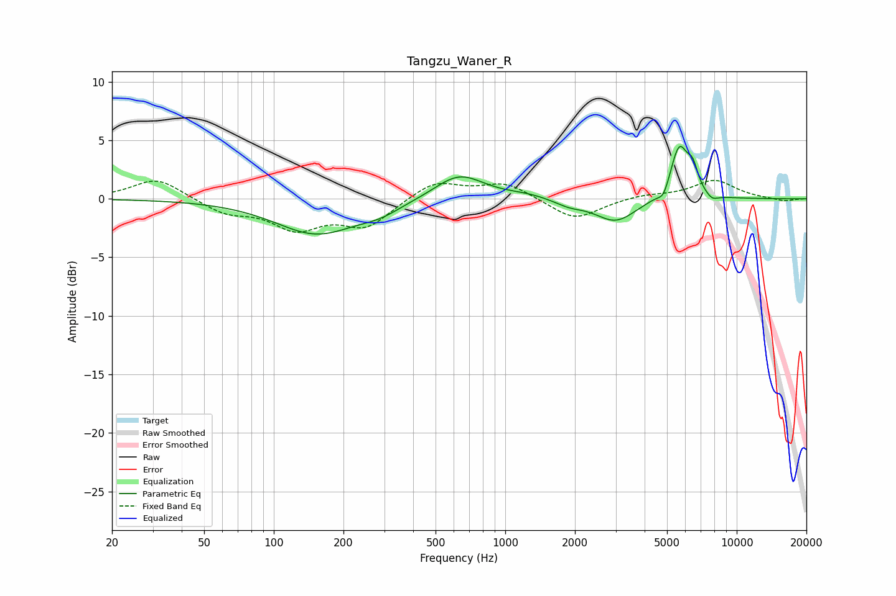

# Tangzu_Waner_R
See [usage instructions](https://github.com/jaakkopasanen/AutoEq#usage) for more options and info.

### Parametric EQs
Apply preamp of -4.6 dB when using parametric equalizer.

|   # | Type    |   Fc (Hz) |    Q |   Gain (dB) |
|-----|---------|-----------|------|-------------|
|   1 | Peaking |       153 | 0.79 |        -3   |
|   2 | Peaking |       289 | 1.64 |        -0.6 |
|   3 | Peaking |       633 | 1.32 |         2.2 |
|   4 | Peaking |      1240 | 1.52 |         0.3 |
|   5 | Peaking |      1888 | 2.24 |        -0.5 |
|   6 | Peaking |      3000 | 1.59 |        -2   |
|   7 | Peaking |      4832 | 6    |        -0.9 |
|   8 | Peaking |      5645 | 3.52 |         4.6 |
|   9 | Peaking |      6460 | 5.99 |         1.7 |
|  10 | Peaking |      7827 | 4.86 |        -0.5 |

### Fixed Band EQs
When using fixed band (also called graphic) equalizer, apply preamp of **-1.7 dB** (if available) and set gains manually with these parameters.

|   # | Type    |   Fc (Hz) |    Q |   Gain (dB) |
|-----|---------|-----------|------|-------------|
|   1 | Peaking |        31 | 1.41 |         1.8 |
|   2 | Peaking |        62 | 1.41 |        -1.1 |
|   3 | Peaking |       125 | 1.41 |        -2.4 |
|   4 | Peaking |       250 | 1.41 |        -2.3 |
|   5 | Peaking |       500 | 1.41 |         1.6 |
|   6 | Peaking |      1000 | 1.41 |         1.3 |
|   7 | Peaking |      2000 | 1.41 |        -1.9 |
|   8 | Peaking |      4000 | 1.41 |         0.3 |
|   9 | Peaking |      8000 | 1.41 |         1.6 |
|  10 | Peaking |     16000 | 1.41 |        -0.2 |

### Graphs

