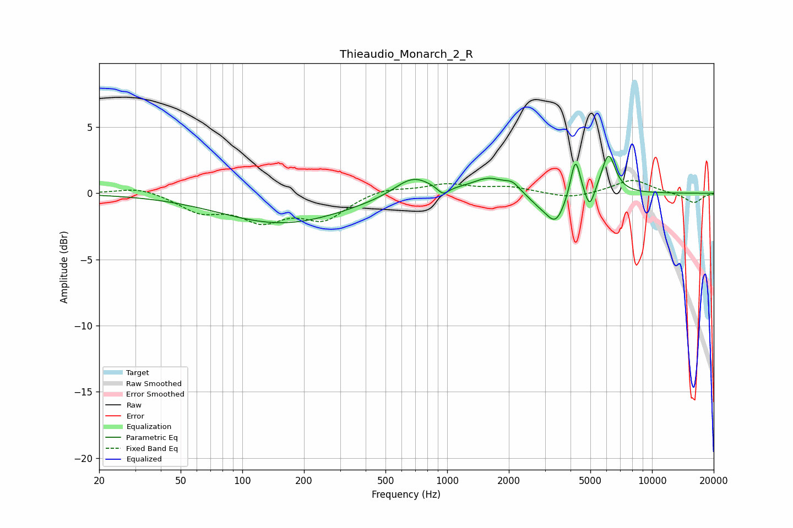

# Thieaudio_Monarch_2_R
See [usage instructions](https://github.com/jaakkopasanen/AutoEq#usage) for more options and info.

### Parametric EQs
Apply preamp of -2.9 dB when using parametric equalizer.

|   # | Type    |   Fc (Hz) |    Q |   Gain (dB) |
|-----|---------|-----------|------|-------------|
|   1 | Peaking |       157 | 0.47 |        -2.3 |
|   2 | Peaking |       678 | 1.56 |         1.5 |
|   3 | Peaking |       955 | 5.09 |        -0.6 |
|   4 | Peaking |      1602 | 1.67 |         1.1 |
|   5 | Peaking |      2084 | 4.08 |         0.6 |
|   6 | Peaking |      2826 | 2.37 |        -0.6 |
|   7 | Peaking |      3392 | 3.01 |        -2.1 |
|   8 | Peaking |      4227 | 5.98 |         3   |
|   9 | Peaking |      4962 | 6    |        -1.6 |
|  10 | Peaking |      6130 | 4.02 |         3   |

### Fixed Band EQs
When using fixed band (also called graphic) equalizer, apply preamp of **-1.1 dB** (if available) and set gains manually with these parameters.

|   # | Type    |   Fc (Hz) |    Q |   Gain (dB) |
|-----|---------|-----------|------|-------------|
|   1 | Peaking |        31 | 1.41 |         0.5 |
|   2 | Peaking |        62 | 1.41 |        -1.3 |
|   3 | Peaking |       125 | 1.41 |        -1.8 |
|   4 | Peaking |       250 | 1.41 |        -1.8 |
|   5 | Peaking |       500 | 1.41 |         0.5 |
|   6 | Peaking |      1000 | 1.41 |         0.7 |
|   7 | Peaking |      2000 | 1.41 |         0.4 |
|   8 | Peaking |      4000 | 1.41 |        -0.4 |
|   9 | Peaking |      8000 | 1.41 |         1   |
|  10 | Peaking |     16000 | 1.41 |        -0.7 |

### Graphs

