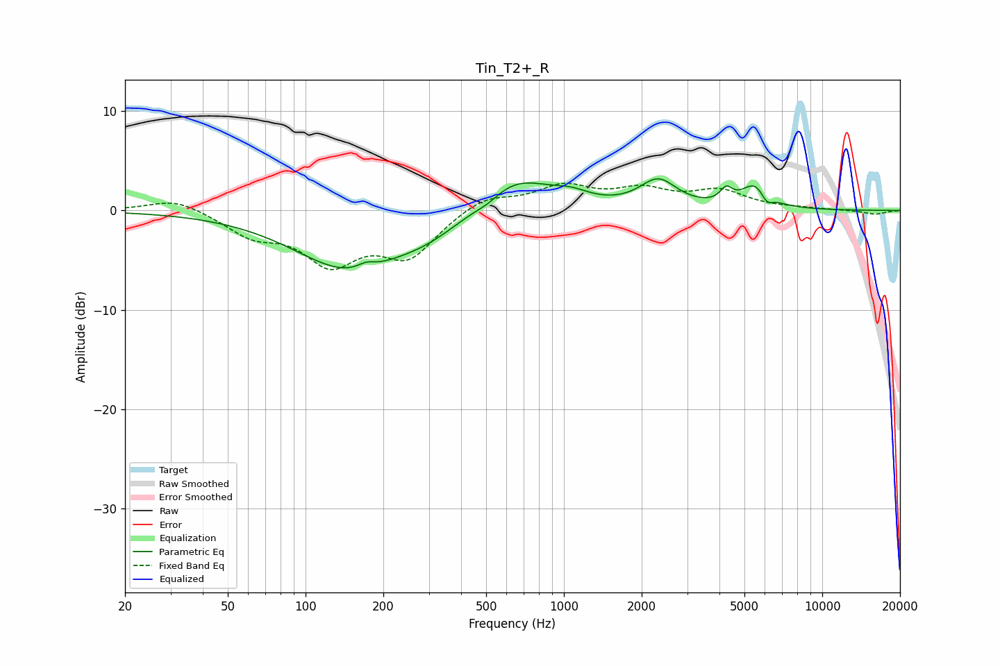

# Tin_T2+_R
See [usage instructions](https://github.com/jaakkopasanen/AutoEq#usage) for more options and info.

### Parametric EQs
Apply preamp of -3.3 dB when using parametric equalizer.

|   # | Type    |   Fc (Hz) |    Q |   Gain (dB) |
|-----|---------|-----------|------|-------------|
|   1 | Peaking |       147 | 0.66 |        -5.8 |
|   2 | Peaking |       172 | 4.13 |         0.6 |
|   3 | Peaking |       298 | 1.06 |        -1.3 |
|   4 | Peaking |       506 | 3.05 |        -0.5 |
|   5 | Peaking |       650 | 1.03 |         3.5 |
|   6 | Peaking |      1069 | 1.96 |         0.9 |
|   7 | Peaking |      2319 | 1.98 |         2.8 |
|   8 | Peaking |      4252 | 6    |         1.3 |
|   9 | Peaking |      5510 | 2.59 |         2.5 |
|  10 | Peaking |      6090 | 5.99 |        -1.1 |

### Fixed Band EQs
When using fixed band (also called graphic) equalizer, apply preamp of **-2.8 dB** (if available) and set gains manually with these parameters.

|   # | Type    |   Fc (Hz) |    Q |   Gain (dB) |
|-----|---------|-----------|------|-------------|
|   1 | Peaking |        31 | 1.41 |         1.3 |
|   2 | Peaking |        62 | 1.41 |        -2.2 |
|   3 | Peaking |       125 | 1.41 |        -4.9 |
|   4 | Peaking |       250 | 1.41 |        -4.4 |
|   5 | Peaking |       500 | 1.41 |         1.5 |
|   6 | Peaking |      1000 | 1.41 |         2.3 |
|   7 | Peaking |      2000 | 1.41 |         1.8 |
|   8 | Peaking |      4000 | 1.41 |         1.8 |
|   9 | Peaking |      8000 | 1.41 |         0.1 |
|  10 | Peaking |     16000 | 1.41 |        -0.4 |

### Graphs

