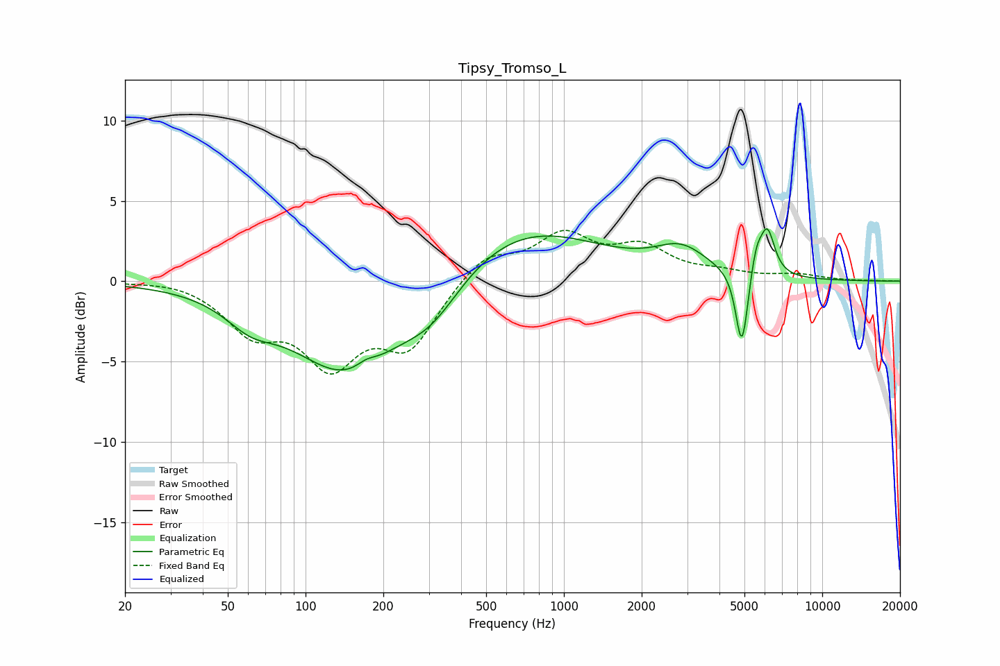

# Tipsy_Tromso_L
See [usage instructions](https://github.com/jaakkopasanen/AutoEq#usage) for more options and info.

### Parametric EQs
Apply preamp of -3.4 dB when using parametric equalizer.

|   # | Type    |   Fc (Hz) |    Q |   Gain (dB) |
|-----|---------|-----------|------|-------------|
|   1 | Peaking |        61 | 1.48 |        -1.4 |
|   2 | Peaking |       145 | 0.67 |        -5.7 |
|   3 | Peaking |       172 | 3.63 |         0.4 |
|   4 | Peaking |       308 | 1.2  |        -2.1 |
|   5 | Peaking |       683 | 0.48 |         3.5 |
|   6 | Peaking |      2849 | 1.39 |         1.6 |
|   7 | Peaking |      4869 | 6    |        -4.1 |
|   8 | Peaking |      4971 | 6    |        -0.9 |
|   9 | Peaking |      5549 | 6    |         1.6 |
|  10 | Peaking |      6133 | 4.86 |         2.8 |

### Fixed Band EQs
When using fixed band (also called graphic) equalizer, apply preamp of **-3.3 dB** (if available) and set gains manually with these parameters.

|   # | Type    |   Fc (Hz) |    Q |   Gain (dB) |
|-----|---------|-----------|------|-------------|
|   1 | Peaking |        31 | 1.41 |         0.2 |
|   2 | Peaking |        62 | 1.41 |        -2.8 |
|   3 | Peaking |       125 | 1.41 |        -4.7 |
|   4 | Peaking |       250 | 1.41 |        -3.8 |
|   5 | Peaking |       500 | 1.41 |         1.7 |
|   6 | Peaking |      1000 | 1.41 |         2.7 |
|   7 | Peaking |      2000 | 1.41 |         1.9 |
|   8 | Peaking |      4000 | 1.41 |         0.4 |
|   9 | Peaking |      8000 | 1.41 |         0.4 |
|  10 | Peaking |     16000 | 1.41 |         0   |

### Graphs

