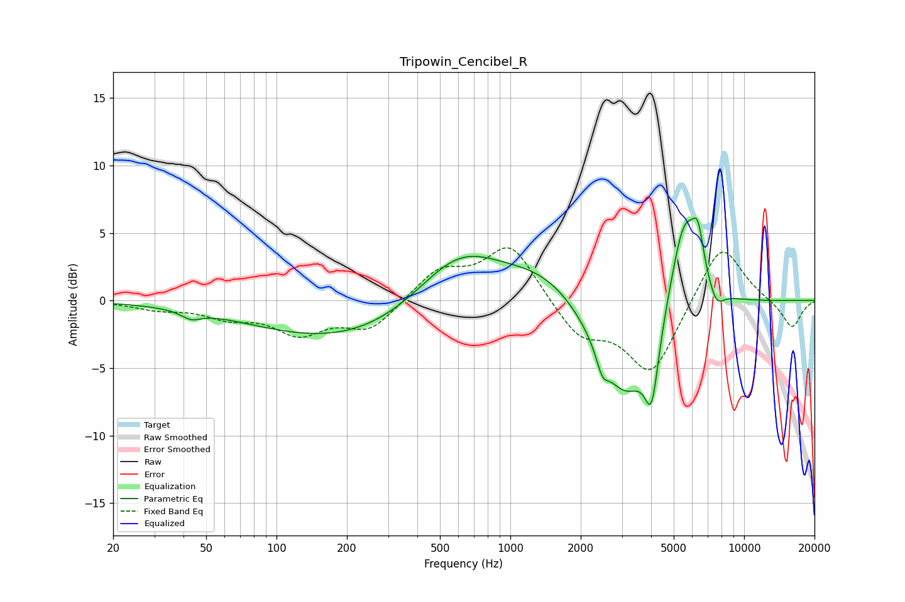

# Tripowin_Cencibel_R
See [usage instructions](https://github.com/jaakkopasanen/AutoEq#usage) for more options and info.

### Parametric EQs
Apply preamp of -6.2 dB when using parametric equalizer.

|   # | Type    |   Fc (Hz) |    Q |   Gain (dB) |
|-----|---------|-----------|------|-------------|
|   1 | Peaking |        43 | 3.38 |        -0.6 |
|   2 | Peaking |       228 | 0.33 |        -3.3 |
|   3 | Peaking |       598 | 0.73 |         4.8 |
|   4 | Peaking |      1429 | 0.79 |         2.2 |
|   5 | Peaking |      2475 | 5.67 |        -1.4 |
|   6 | Peaking |      3108 | 1.12 |        -7.7 |
|   7 | Peaking |      4024 | 4.78 |        -4.9 |
|   8 | Peaking |      5542 | 2.17 |         7.6 |
|   9 | Peaking |      6348 | 5.64 |         2.8 |
|  10 | Peaking |      7595 | 4.12 |        -1.4 |

### Fixed Band EQs
When using fixed band (also called graphic) equalizer, apply preamp of **-4.0 dB** (if available) and set gains manually with these parameters.

|   # | Type    |   Fc (Hz) |    Q |   Gain (dB) |
|-----|---------|-----------|------|-------------|
|   1 | Peaking |        31 | 1.41 |        -0.5 |
|   2 | Peaking |        62 | 1.41 |        -1   |
|   3 | Peaking |       125 | 1.41 |        -2.2 |
|   4 | Peaking |       250 | 1.41 |        -2.1 |
|   5 | Peaking |       500 | 1.41 |         2.2 |
|   6 | Peaking |      1000 | 1.41 |         4.2 |
|   7 | Peaking |      2000 | 1.41 |        -2.6 |
|   8 | Peaking |      4000 | 1.41 |        -5.4 |
|   9 | Peaking |      8000 | 1.41 |         4.5 |
|  10 | Peaking |     16000 | 1.41 |        -2.1 |

### Graphs

