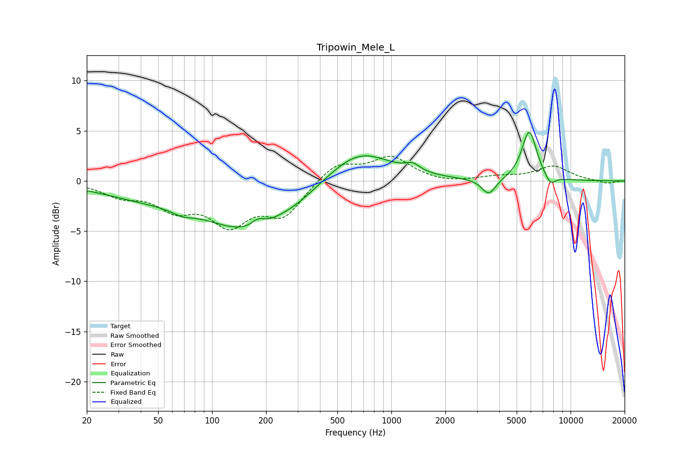

# Tripowin_Mele_L
See [usage instructions](https://github.com/jaakkopasanen/AutoEq#usage) for more options and info.

### Parametric EQs
Apply preamp of -4.9 dB when using parametric equalizer.

|   # | Type    |   Fc (Hz) |    Q |   Gain (dB) |
|-----|---------|-----------|------|-------------|
|   1 | Peaking |        43 | 0.52 |        -1.4 |
|   2 | Peaking |        68 | 2.5  |        -0.5 |
|   3 | Peaking |       161 | 0.58 |        -4.6 |
|   4 | Peaking |       181 | 4.01 |         0.7 |
|   5 | Peaking |       307 | 1.35 |        -0.4 |
|   6 | Peaking |       660 | 0.81 |         3.3 |
|   7 | Peaking |      1316 | 3.59 |         0.7 |
|   8 | Peaking |      3498 | 3.56 |        -1.6 |
|   9 | Peaking |      5879 | 3.33 |         5   |
|  10 | Peaking |      7691 | 4.5  |        -1   |

### Fixed Band EQs
When using fixed band (also called graphic) equalizer, apply preamp of **-2.5 dB** (if available) and set gains manually with these parameters.

|   # | Type    |   Fc (Hz) |    Q |   Gain (dB) |
|-----|---------|-----------|------|-------------|
|   1 | Peaking |        31 | 1.41 |        -1.3 |
|   2 | Peaking |        62 | 1.41 |        -2.4 |
|   3 | Peaking |       125 | 1.41 |        -3.9 |
|   4 | Peaking |       250 | 1.41 |        -3.2 |
|   5 | Peaking |       500 | 1.41 |         1.9 |
|   6 | Peaking |      1000 | 1.41 |         2.3 |
|   7 | Peaking |      2000 | 1.41 |        -0.3 |
|   8 | Peaking |      4000 | 1.41 |         0.4 |
|   9 | Peaking |      8000 | 1.41 |         1.4 |
|  10 | Peaking |     16000 | 1.41 |        -0.3 |

### Graphs

