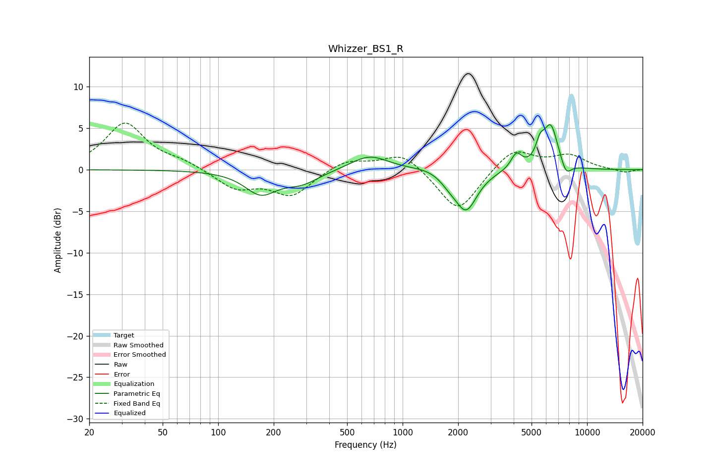

# Whizzer_BS1_R
See [usage instructions](https://github.com/jaakkopasanen/AutoEq#usage) for more options and info.

### Parametric EQs
Apply preamp of -5.5 dB when using parametric equalizer.

|   # | Type    |   Fc (Hz) |    Q |   Gain (dB) |
|-----|---------|-----------|------|-------------|
|   1 | Peaking |       170 | 1.65 |        -2.7 |
|   2 | Peaking |       284 | 1.47 |        -1.4 |
|   3 | Peaking |       661 | 1.39 |         1.8 |
|   4 | Peaking |      1375 | 1.65 |         0.3 |
|   5 | Peaking |      1778 | 3.15 |        -0.7 |
|   6 | Peaking |      2206 | 2.33 |        -4.9 |
|   7 | Peaking |      4136 | 4.8  |         1.9 |
|   8 | Peaking |      5563 | 6    |         2   |
|   9 | Peaking |      6357 | 3.42 |         5.2 |
|  10 | Peaking |      7690 | 4.75 |        -1.6 |

### Fixed Band EQs
When using fixed band (also called graphic) equalizer, apply preamp of **-5.7 dB** (if available) and set gains manually with these parameters.

|   # | Type    |   Fc (Hz) |    Q |   Gain (dB) |
|-----|---------|-----------|------|-------------|
|   1 | Peaking |        31 | 1.41 |         5.6 |
|   2 | Peaking |        62 | 1.41 |         0.8 |
|   3 | Peaking |       125 | 1.41 |        -2.2 |
|   4 | Peaking |       250 | 1.41 |        -3   |
|   5 | Peaking |       500 | 1.41 |         1.3 |
|   6 | Peaking |      1000 | 1.41 |         2.2 |
|   7 | Peaking |      2000 | 1.41 |        -5.3 |
|   8 | Peaking |      4000 | 1.41 |         2.7 |
|   9 | Peaking |      8000 | 1.41 |         1.6 |
|  10 | Peaking |     16000 | 1.41 |        -0.4 |

### Graphs

