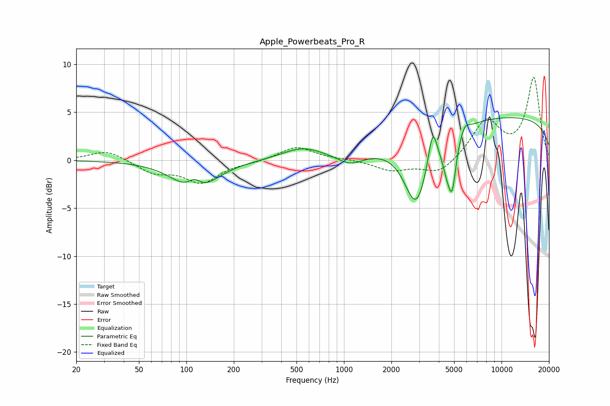

# Apple_Powerbeats_Pro_R
See [usage instructions](https://github.com/jaakkopasanen/AutoEq#usage) for more options and info.

### Parametric EQs
Apply preamp of -4.5 dB when using parametric equalizer.

|   # | Type    |   Fc (Hz) |    Q |   Gain (dB) |
|-----|---------|-----------|------|-------------|
|   1 | Peaking |       112 | 3.07 |         1.5 |
|   2 | Peaking |       113 | 1.18 |        -3.6 |
|   3 | Peaking |       545 | 1.1  |         1.3 |
|   4 | Peaking |      1099 | 1.73 |        -1.1 |
|   5 | Peaking |      2875 | 1.85 |        -7.2 |
|   6 | Peaking |      3650 | 5.37 |         3.6 |
|   7 | Peaking |      4487 | 4.56 |        -2.3 |
|   8 | Peaking |      4859 | 5.65 |        -4.8 |
|   9 | Peaking |      5839 | 4.9  |         0.9 |
|  10 | Peaking |     10000 | 0.18 |         4.6 |

### Fixed Band EQs
When using fixed band (also called graphic) equalizer, apply preamp of **-8.7 dB** (if available) and set gains manually with these parameters.

|   # | Type    |   Fc (Hz) |    Q |   Gain (dB) |
|-----|---------|-----------|------|-------------|
|   1 | Peaking |        31 | 1.41 |         1.1 |
|   2 | Peaking |        62 | 1.41 |        -1.2 |
|   3 | Peaking |       125 | 1.41 |        -2.2 |
|   4 | Peaking |       250 | 1.41 |        -0.2 |
|   5 | Peaking |       500 | 1.41 |         1.4 |
|   6 | Peaking |      1000 | 1.41 |         0.1 |
|   7 | Peaking |      2000 | 1.41 |        -1   |
|   8 | Peaking |      4000 | 1.41 |        -1.5 |
|   9 | Peaking |      8000 | 1.41 |         4   |
|  10 | Peaking |     16000 | 1.41 |         8.5 |

### Graphs

