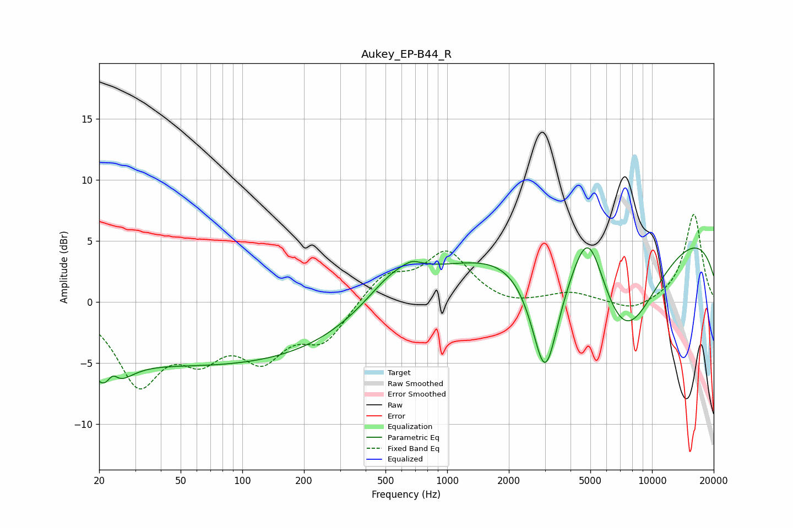

# Aukey_EP-B44_R
See [usage instructions](https://github.com/jaakkopasanen/AutoEq#usage) for more options and info.

### Parametric EQs
Apply preamp of -4.5 dB when using parametric equalizer.

|   # | Type    |   Fc (Hz) |    Q |   Gain (dB) |
|-----|---------|-----------|------|-------------|
|   1 | Peaking |        22 | 1.82 |        -3.7 |
|   2 | Peaking |        23 | 4.95 |         1.5 |
|   3 | Peaking |        74 | 0.18 |        -5.1 |
|   4 | Peaking |       561 | 1    |         2.6 |
|   5 | Peaking |       674 | 3.62 |         0.4 |
|   6 | Peaking |      1741 | 0.33 |         2.5 |
|   7 | Peaking |      3007 | 2    |       -10.2 |
|   8 | Peaking |      4887 | 1.81 |         5.5 |
|   9 | Peaking |      7258 | 0.74 |        -9.6 |
|  10 | Peaking |      9886 | 0.18 |         6.6 |

### Fixed Band EQs
When using fixed band (also called graphic) equalizer, apply preamp of **-7.3 dB** (if available) and set gains manually with these parameters.

|   # | Type    |   Fc (Hz) |    Q |   Gain (dB) |
|-----|---------|-----------|------|-------------|
|   1 | Peaking |        31 | 1.41 |        -6.3 |
|   2 | Peaking |        62 | 1.41 |        -3.5 |
|   3 | Peaking |       125 | 1.41 |        -4   |
|   4 | Peaking |       250 | 1.41 |        -3   |
|   5 | Peaking |       500 | 1.41 |         2.2 |
|   6 | Peaking |      1000 | 1.41 |         4   |
|   7 | Peaking |      2000 | 1.41 |        -0.5 |
|   8 | Peaking |      4000 | 1.41 |         0.8 |
|   9 | Peaking |      8000 | 1.41 |        -0.8 |
|  10 | Peaking |     16000 | 1.41 |         7.2 |

### Graphs

