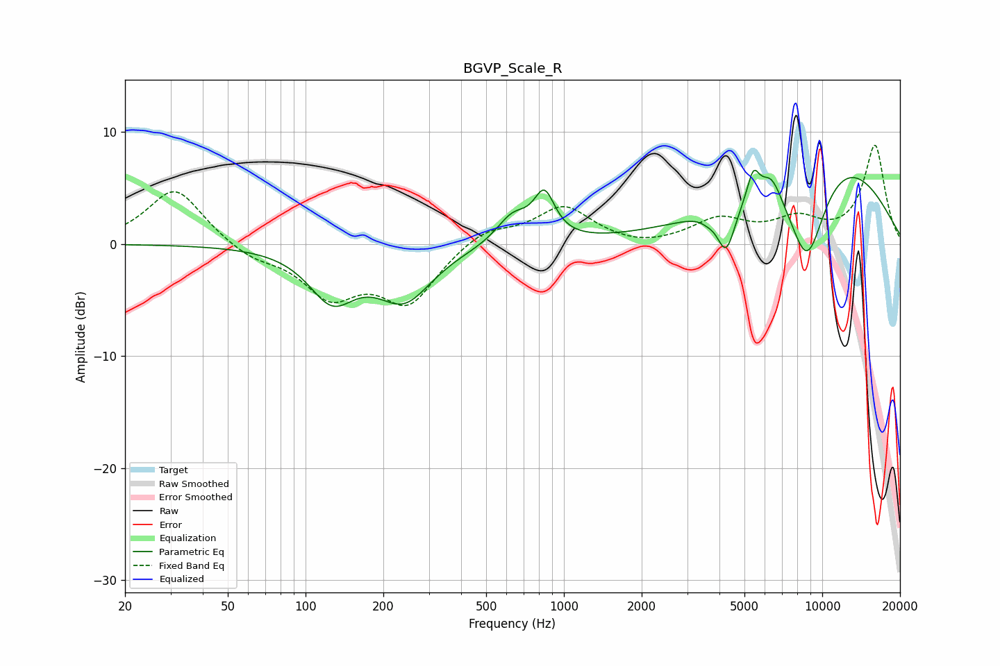

# BGVP_Scale_R
See [usage instructions](https://github.com/jaakkopasanen/AutoEq#usage) for more options and info.

### Parametric EQs
Apply preamp of -6.7 dB when using parametric equalizer.

|   # | Type    |   Fc (Hz) |    Q |   Gain (dB) |
|-----|---------|-----------|------|-------------|
|   1 | Peaking |       127 | 1.58 |        -4.4 |
|   2 | Peaking |       241 | 1.31 |        -4.7 |
|   3 | Peaking |       633 | 2.25 |         2.4 |
|   4 | Peaking |       840 | 3.48 |         3.9 |
|   5 | Peaking |      3595 | 5.89 |        -0.3 |
|   6 | Peaking |      4247 | 3.99 |        -4.2 |
|   7 | Peaking |      5411 | 6    |         2.6 |
|   8 | Peaking |      6360 | 3.34 |         2.2 |
|   9 | Peaking |      8734 | 1.62 |        -9.6 |
|  10 | Peaking |     10000 | 0.41 |         9   |

### Fixed Band EQs
When using fixed band (also called graphic) equalizer, apply preamp of **-8.9 dB** (if available) and set gains manually with these parameters.

|   # | Type    |   Fc (Hz) |    Q |   Gain (dB) |
|-----|---------|-----------|------|-------------|
|   1 | Peaking |        31 | 1.41 |         5.1 |
|   2 | Peaking |        62 | 1.41 |        -1.2 |
|   3 | Peaking |       125 | 1.41 |        -4.3 |
|   4 | Peaking |       250 | 1.41 |        -5   |
|   5 | Peaking |       500 | 1.41 |         1.5 |
|   6 | Peaking |      1000 | 1.41 |         3.3 |
|   7 | Peaking |      2000 | 1.41 |        -0.4 |
|   8 | Peaking |      4000 | 1.41 |         2.1 |
|   9 | Peaking |      8000 | 1.41 |         1.9 |
|  10 | Peaking |     16000 | 1.41 |         8.7 |

### Graphs

