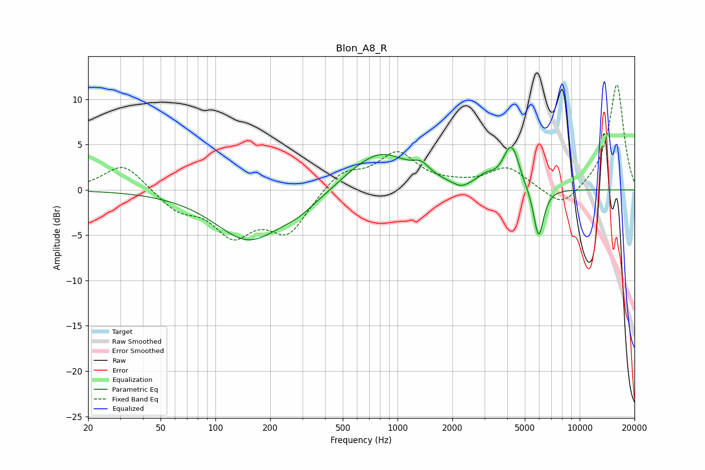

# Blon_A8_R
See [usage instructions](https://github.com/jaakkopasanen/AutoEq#usage) for more options and info.

### Parametric EQs
Apply preamp of -4.8 dB when using parametric equalizer.

|   # | Type    |   Fc (Hz) |    Q |   Gain (dB) |
|-----|---------|-----------|------|-------------|
|   1 | Peaking |       152 | 0.77 |        -5.5 |
|   2 | Peaking |       287 | 1.46 |        -1.1 |
|   3 | Peaking |       553 | 2.47 |         0.2 |
|   4 | Peaking |       807 | 0.92 |         4.2 |
|   5 | Peaking |      1350 | 3.06 |         1.2 |
|   6 | Peaking |      2229 | 3.19 |        -0.7 |
|   7 | Peaking |      3057 | 2.87 |         1   |
|   8 | Peaking |      4170 | 3.26 |         4.4 |
|   9 | Peaking |      4471 | 6    |         0.6 |
|  10 | Peaking |      5951 | 4.92 |        -5.6 |

### Fixed Band EQs
When using fixed band (also called graphic) equalizer, apply preamp of **-11.7 dB** (if available) and set gains manually with these parameters.

|   # | Type    |   Fc (Hz) |    Q |   Gain (dB) |
|-----|---------|-----------|------|-------------|
|   1 | Peaking |        31 | 1.41 |         3   |
|   2 | Peaking |        62 | 1.41 |        -2.1 |
|   3 | Peaking |       125 | 1.41 |        -4.5 |
|   4 | Peaking |       250 | 1.41 |        -4.5 |
|   5 | Peaking |       500 | 1.41 |         2.1 |
|   6 | Peaking |      1000 | 1.41 |         3.9 |
|   7 | Peaking |      2000 | 1.41 |         0.3 |
|   8 | Peaking |      4000 | 1.41 |         2.4 |
|   9 | Peaking |      8000 | 1.41 |        -2.2 |
|  10 | Peaking |     16000 | 1.41 |        11.8 |

### Graphs

