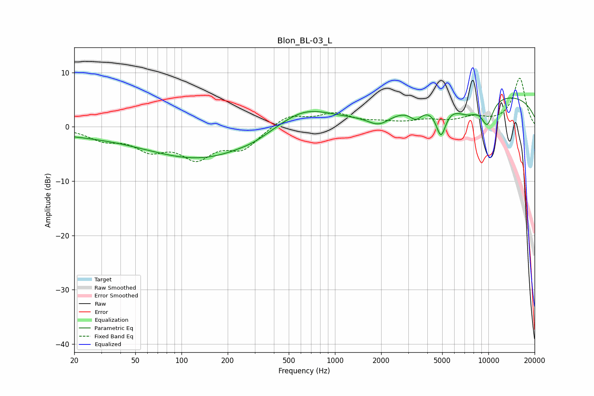

# Blon_BL-03_L
See [usage instructions](https://github.com/jaakkopasanen/AutoEq#usage) for more options and info.

### Parametric EQs
Apply preamp of -5.4 dB when using parametric equalizer.

|   # | Type    |   Fc (Hz) |    Q |   Gain (dB) |
|-----|---------|-----------|------|-------------|
|   1 | Peaking |        20 | 0.3  |        -1.1 |
|   2 | Peaking |       138 | 0.4  |        -5.7 |
|   3 | Peaking |       295 | 1.77 |        -0.4 |
|   4 | Peaking |       625 | 0.79 |         3.8 |
|   5 | Peaking |      1935 | 1.9  |        -2.1 |
|   6 | Peaking |      3375 | 3.59 |        -1.9 |
|   7 | Peaking |      4907 | 4.29 |        -5.5 |
|   8 | Peaking |      7316 | 1.6  |        -2.8 |
|   9 | Peaking |      9833 | 3.19 |        -4.6 |
|  10 | Peaking |     10000 | 0.2  |         6.2 |

### Fixed Band EQs
When using fixed band (also called graphic) equalizer, apply preamp of **-9.0 dB** (if available) and set gains manually with these parameters.

|   # | Type    |   Fc (Hz) |    Q |   Gain (dB) |
|-----|---------|-----------|------|-------------|
|   1 | Peaking |        31 | 1.41 |        -2   |
|   2 | Peaking |        62 | 1.41 |        -3.6 |
|   3 | Peaking |       125 | 1.41 |        -5.1 |
|   4 | Peaking |       250 | 1.41 |        -3.7 |
|   5 | Peaking |       500 | 1.41 |         2.2 |
|   6 | Peaking |      1000 | 1.41 |         2.2 |
|   7 | Peaking |      2000 | 1.41 |         0.6 |
|   8 | Peaking |      4000 | 1.41 |         1   |
|   9 | Peaking |      8000 | 1.41 |         1.5 |
|  10 | Peaking |     16000 | 1.41 |         8.9 |

### Graphs

