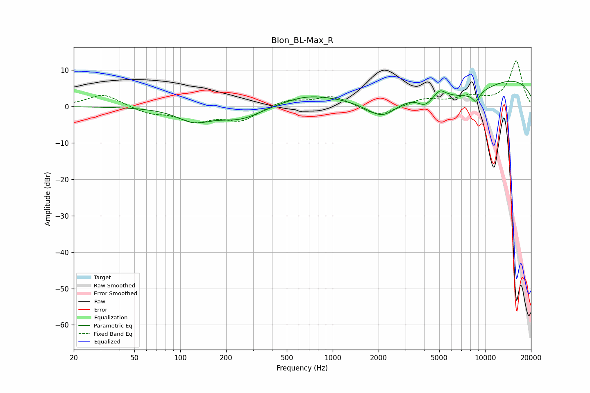

# Blon_BL-Max_R
See [usage instructions](https://github.com/jaakkopasanen/AutoEq#usage) for more options and info.

### Parametric EQs
Apply preamp of -7.0 dB when using parametric equalizer.

|   # | Type    |   Fc (Hz) |    Q |   Gain (dB) |
|-----|---------|-----------|------|-------------|
|   1 | Peaking |       123 | 1.3  |        -3.6 |
|   2 | Peaking |       248 | 0.98 |        -3.5 |
|   3 | Peaking |       682 | 0.75 |         2.8 |
|   4 | Peaking |      2120 | 1.23 |        -6.5 |
|   5 | Peaking |      4036 | 2.88 |        -3   |
|   6 | Peaking |      5058 | 4.12 |         1.8 |
|   7 | Peaking |      7398 | 0.66 |        -5.6 |
|   8 | Peaking |      8678 | 5.88 |        -2.3 |
|   9 | Peaking |      9115 | 5.93 |        -0.3 |
|  10 | Peaking |      9531 | 0.19 |         9.4 |

### Fixed Band EQs
When using fixed band (also called graphic) equalizer, apply preamp of **-12.7 dB** (if available) and set gains manually with these parameters.

|   # | Type    |   Fc (Hz) |    Q |   Gain (dB) |
|-----|---------|-----------|------|-------------|
|   1 | Peaking |        31 | 1.41 |         3.5 |
|   2 | Peaking |        62 | 1.41 |        -1.8 |
|   3 | Peaking |       125 | 1.41 |        -3.7 |
|   4 | Peaking |       250 | 1.41 |        -3.7 |
|   5 | Peaking |       500 | 1.41 |         1.9 |
|   6 | Peaking |      1000 | 1.41 |         2.9 |
|   7 | Peaking |      2000 | 1.41 |        -2.9 |
|   8 | Peaking |      4000 | 1.41 |         2   |
|   9 | Peaking |      8000 | 1.41 |         2.3 |
|  10 | Peaking |     16000 | 1.41 |        12.5 |

### Graphs

