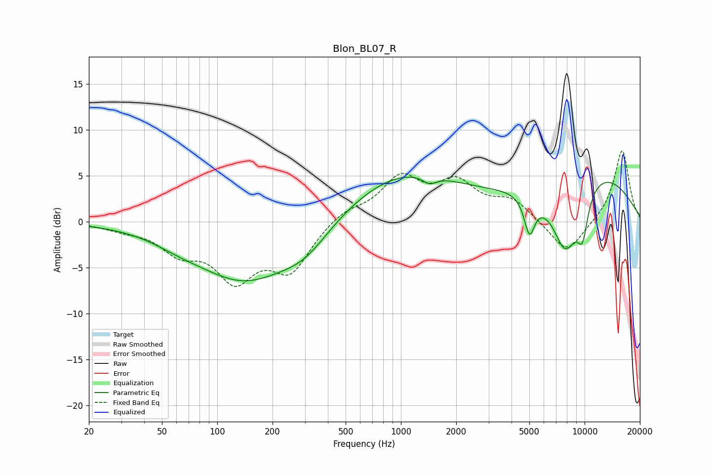

# Blon_BL07_R
See [usage instructions](https://github.com/jaakkopasanen/AutoEq#usage) for more options and info.

### Parametric EQs
Apply preamp of -4.9 dB when using parametric equalizer.

|   # | Type    |   Fc (Hz) |    Q |   Gain (dB) |
|-----|---------|-----------|------|-------------|
|   1 | Peaking |        61 | 1.06 |        -0.6 |
|   2 | Peaking |       140 | 0.53 |        -6.2 |
|   3 | Peaking |       300 | 1.05 |        -2.3 |
|   4 | Peaking |      1041 | 0.45 |         5.3 |
|   5 | Peaking |      1431 | 3.65 |        -0.9 |
|   6 | Peaking |      5011 | 4.74 |        -4.1 |
|   7 | Peaking |      5892 | 3.31 |        -0.2 |
|   8 | Peaking |      7863 | 1.65 |        -8.3 |
|   9 | Peaking |      9742 | 3.97 |        -4.3 |
|  10 | Peaking |     10000 | 0.38 |         6.2 |

### Fixed Band EQs
When using fixed band (also called graphic) equalizer, apply preamp of **-7.8 dB** (if available) and set gains manually with these parameters.

|   # | Type    |   Fc (Hz) |    Q |   Gain (dB) |
|-----|---------|-----------|------|-------------|
|   1 | Peaking |        31 | 1.41 |        -0.6 |
|   2 | Peaking |        62 | 1.41 |        -2.8 |
|   3 | Peaking |       125 | 1.41 |        -5.7 |
|   4 | Peaking |       250 | 1.41 |        -5   |
|   5 | Peaking |       500 | 1.41 |         1.2 |
|   6 | Peaking |      1000 | 1.41 |         4.5 |
|   7 | Peaking |      2000 | 1.41 |         3.8 |
|   8 | Peaking |      4000 | 1.41 |         2.2 |
|   9 | Peaking |      8000 | 1.41 |        -3.7 |
|  10 | Peaking |     16000 | 1.41 |         7.9 |

### Graphs

